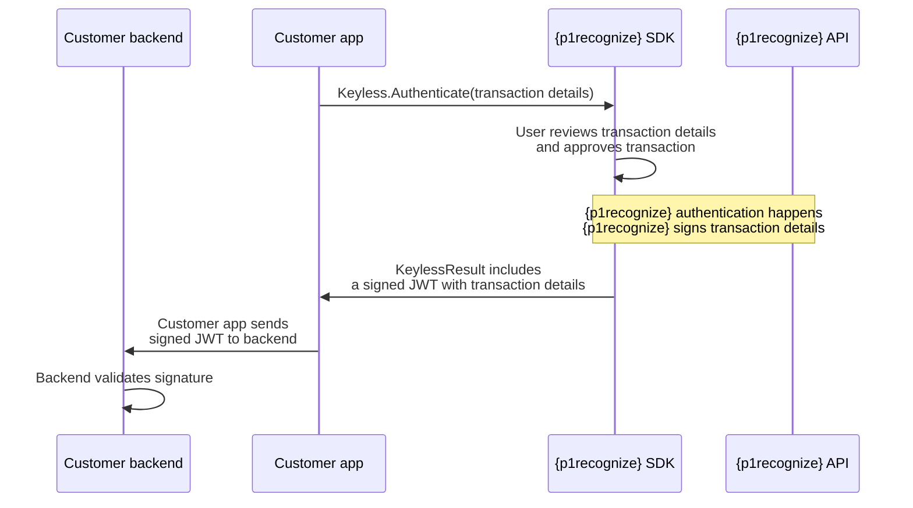

# Account Recovery

## What Is Account Recovery?

Account recovery describes the use case where a user is known to the customer (that is, registered in PingOne Recognize) but needs to be authenticated on a new device. Typically this is where:

* The user was previously enrolled on a device but no longer has access to it.

* The user is adding a backup device.

* The user is known to the customer (for example, submitted a selfie during onboarding) but has not yet authenticated on a device via Mobile SDK in the customer app (which would require [PingOne Recognize IDV Bridge](../idv-bridge/idv-bridge-on-premise.html)).

## Client State

PingOne Recognize can recover an account from the PingOne Recognize [client state](../introduction/account_recovery.html).

The client state is obtained either:

1. From your backend through PingOne Recognize IDV Bridge:

   * To generate this state, see [IDV Bridge SaaS](../idv-bridge/idv-bridge-saas.html) or [IDV On-Premise](../idv-bridge/idv-bridge-on-premise.html).

   * Then refer to [New Device Activation](mobile-sdk-new-device-activation.html) to learn how to use this state to bind a user ID to a new device.

2. From your client app using the PingOne Recognize Mobile SDK:

   * [Generate the client state](mobile-sdk-generating-client-state.html) during live enrollment or authentication.

   * Then refer to [New Device Activation](mobile-sdk-new-device-activation.html) to learn how to use this state to bind a user ID to a new device.

---

---
title: Authenticating in Auth0 with PingOne Recognize
description: Integrate PingOne Recognize authentication with Auth0.
component: recognize
page_id: recognize:mobile-sdk:mobile-sdk-authenticating-in-auth0
canonical_url: https://docs.pingidentity.com/recognize/mobile-sdk/mobile-sdk-authenticating-in-auth0.html
llms_txt: https://docs.pingidentity.com/recognize/llms.txt
docs_for_agents: https://developer.pingidentity.com/build-with-ai/docs-for-agents.md
section_ids:
  configure-enterprise-oidc-connection-in-auth0: Configure Enterprise OIDC Connection in Auth0
  step-1-create-a-connection-in-auth0: "Step 1: Create a Connection in Auth0"
  step-2-enable-the-connection-for-applications: "Step 2: Enable the Connection for Applications"
  step-3-link-pingone-recognize-accounts-to-auth0-accounts: "Step 3: Link PingOne Recognize Accounts to Auth0 Accounts"
  mobile-integration: Mobile Integration
  enrollment: Enrollment
  android: Android
  ios: iOS
  flutter: Flutter
  authentication: Authentication
  android-2: Android
  ios-2: iOS
  flutter-2: Flutter
  openid-url-configuration: OpenID URL Configuration
---

# Authenticating in Auth0 with PingOne Recognize

Integrating PingOne Recognize authentication with existing IAMs requires preparation on multiple parts of the customer service provider.

* **Binding Auth0 identity to a PingOne Recognize ID**: This happens during PingOne Recognize enrollment. The user performs enrollment with a configuration option that accepts an `idToken` from Auth0. Retrieve this token via the standard Auth0 login flow.

* **Account linking**: After `idToken` is bound to a PingOne Recognize identity, Auth0 authentication with PingOne Recognize can succeed. However, authentication can return a different `user_id` unless the Auth0 `user_id` and PingOne Recognize `user_id` are linked. Learn more in [Auth0 account linking](https://auth0.com/docs/manage-users/user-accounts/user-account-linking).

## Configure Enterprise OIDC Connection in Auth0

Create a secure connection between PingOne Recognize and Auth0 so PingOne Recognize can be used as an Identity Provider in Auth0.

Before following this guide, contact the PingOne Recognize Delivery Team to obtain:

* **Discovery URL**: `https://idp.keyless.io/realms/YOUR_REALM/.well-known/openid-configuration`

* **Client ID**: Provided by PingOne Recognize Delivery Team.

* **Client Secret**: Provided by PingOne Recognize Delivery Team.

* **Scopes**: Include additional scopes you need (for example: `openid`, `profile`, `email`).

### Step 1: Create a Connection in Auth0

1. Sign in to Auth0 and open the **Dashboard**.

2. Navigate to **Authentication > Enterprise > OpenID Connect**.

3. Select **Create Connection** and set:

   * **Name**: For example, `PingOne Recognize-SDK-Connection`.

   * **Issuer URL**: The discovery URL from the Delivery Team.

4. Test the connection with **Try Connection** in the Auth0 Dashboard.

### Step 2: Enable the Connection for Applications

1. In Auth0, go to **Applications > Applications**.

2. Select your app, open the **Connections** tab, and enable the PingOne Recognize connection.

After setup, pass the Auth0 connection name in the Auth0 `/authorize` endpoint used by your SDK flow.

### Step 3: Link PingOne Recognize Accounts to Auth0 Accounts

This step varies by implementation. Contact PingOne Recognize Solution Engineering to choose the best approach for your setup.

## Mobile Integration

Before enrollment and authentication, follow the [Getting Started with the PingOne Recognize Mobile SDK](mobile-sdk-getting-started.html).

### Enrollment

To enroll a user:

1. Retrieve the `id_token` from Auth0.

2. Perform PingOne Recognize enrollment and provide `id_token` using the `withIAMToken` builder/API.

#### Android

```kotlin
val idToken = "..." // retrieve id_token from Auth0

val configuration = EnrollmentConfiguration.builder
    .withIAMToken(token = idToken)
    .build()

Keyless.enroll(
    enrollmentConfiguration = configuration,
    onCompletion = { result ->
        when (result) {
            is Keyless.KeylessResult.Success -> Log.d("KeylessSDK", "Enroll success - userId ${result.value.keylessId}")
            is Keyless.KeylessResult.Failure -> Log.d("KeylessSDK", "Enroll failure - error code ${result.error.code}")
        }
    }
)
```

#### iOS

```swift
let idToken = "..." // retrieve id_token from Auth0

let configuration = Keyless.EnrollmentConfiguration.builder
    .withIAMToken(token: idToken)
    .build()

Keyless.enroll(enrollmentConfiguration: configuration) { result in
    switch result {
    case .success(let success):
        print("Enroll success - userID \(success.keylessId)")
    case .failure(let failure):
        print("Enroll failed - error \(failure.message)")
    }
}
```

#### Flutter

```dart
import 'package:keyless_flutter_sdk/keyless.dart';
import 'package:keyless_flutter_sdk/models/configurations/enrollment_configuration.dart';

final idToken = "..."; // retrieve id_token from Auth0

final configuration = BiomEnrollConfig(iamToken: idToken);

try {
  final result = await Keyless.instance.enroll(configuration);
  print("Enrollment successful. {p1recognize} ID: ${result.keylessId}");
} catch (error) {
  print("Enrollment failed: $error");
}
```

After enrollment succeeds, continue with authentication.

### Authentication

Before authentication:

* Generate a cryptographically secure UUID (`operationId`).

* Retrieve `keylessId` using `getUserId()`.

Then:

1. Build `login_hint = <operation_id>;<keyless_id>`.

2. Authenticate with PingOne Recognize including `operationId`.

#### Android

```kotlin
val operationId = UUID.randomUUID().toString()
val configuration = AuthenticationConfiguration.builder
    .withOperationInfo(operationId = operationId)
    .build()

Keyless.authenticate(
    authenticationConfiguration = configuration,
    onCompletion = { result ->
        when (result) {
            is Keyless.KeylessResult.Success -> {
                val keylessId = /* Keyless.getUserId() */ "..."
                val loginHint = "$operationId;$keylessId"
                // Start Auth0 flow with {p1recognize} connection and pass login_hint
            }
            is Keyless.KeylessResult.Failure -> {
                Log.d("KeylessSDK", "Authentication failure - error code ${result.error.code}")
            }
        }
    }
)
```

#### iOS

```swift
let operationID = UUID().uuidString
let configuration = Keyless.AuthenticationConfiguration.builder
    .withOperationInfo(id: operationID)
    .build()

Keyless.authenticate(authenticationConfiguration: configuration) { result in
    switch result {
    case .success:
        let loginHint = "\(operationID);\(try! Keyless.getUserId().get())"
        // Start Auth0 flow with {p1recognize} connection and pass login_hint
    case .failure:
        print("Failed authentication, cannot start Auth0 login flow.")
    }
}
```

#### Flutter

```dart
import 'package:keyless_flutter_sdk/keyless.dart';
import 'package:keyless_flutter_sdk/models/configurations/authentication_configuration.dart';
import 'package:uuid/uuid.dart';

final operationId = const Uuid().v4();
final configuration = BiomAuthConfig(operationId: operationId);

try {
  final result = await Keyless.instance.authenticate(configuration);
  final keylessId = await Keyless.instance.getUserId();
  final loginHint = "$operationId;$keylessId";

  // Start Auth0 flow with {p1recognize} connection and pass login_hint
  print("Authentication successful. Login hint: $loginHint");
} catch (error) {
  print("Authentication failed: $error");
}
```

After successful authentication, launch a custom tab to sign in with Auth0 and pass `login_hint` query parameter.

## OpenID URL Configuration

After PingOne Recognize support grants dashboard access, configure OpenID URL in PingOne Recognize Dashboard:

1. Open **Access Control**.

2. Select **IDP Configuration** tab, then **OpenID Configuration**.

3. Set **OpenID Configuration URL** to a valid URL, for example:

   * `https://yourdomain.auth0.com/.well-known/`

   * `https://yourdomain.auth0.com/.well-known`

   * `https://yourdomain.auth0.com/`

   * `https://yourdomain.auth0.com`

4. Select **Save Configuration**.

---

---
title: Components
description: Learn about the interaction between PingOne Recognize components.
component: recognize
page_id: recognize:mobile-sdk:mobile-sdk-components
canonical_url: https://docs.pingidentity.com/recognize/mobile-sdk/mobile-sdk-components.html
llms_txt: https://docs.pingidentity.com/recognize/llms.txt
docs_for_agents: https://developer.pingidentity.com/build-with-ai/docs-for-agents.md
revdate: April 20, 2026
section_ids:
  enrollment: Enrollment
  authentication: Authentication
  account-removal: Account removal
---

# Components

The diagrams below show how the PingOne Recognize SDK, which runs within your mobile app on the user's device, interacts with your application server and with the PingOne Recognize network.

## Enrollment

During enrollment, your mobile app invokes the `enroll` method from the PingOne Recognize SDK, and then:

1. Guides the user through capturing a biometric signal with the device camera.

2. Interacts with PingOne Recognize to generate a new user identifier (PingOne Recognize ID), which is then returned to your mobile app.


## Authentication

Authentication involves your application server, your mobile app, and the PingOne Recognize network, as depicted in Figure 2:

1. This process starts when the user performs an action that requires authentication using your mobile app.

2. The app provides the details of this action to your application server, which generates a challenge. The challenge is sent to the mobile app, which uses the PingOne Recognize SDK to compute the corresponding authentication token using the `authenticate` method.

3. The PingOne Recognize SDK authenticates the user by capturing the user's biometrics using the mobile device's camera.

4. The PingOne Recognize SDK connects to the PingOne Recognize network and runs a secure multi-party computation protocol that authenticates the user and generates the authentication token in response to the challenge provided in Step 2. The PingOne Recognize SDK returns the authentication token to the mobile app.

5. The app sends the token to your application server, which verifies it.

6. If the authentication token is valid, the application server completes the transaction and notifies your mobile app.

-\(1\).svg)

## Account removal

Account removal is similar to authentication. First, your mobile app performs [authentication](#authentication) steps 1 - 6, then it notifies your application server that the user wants to delete the account. Next, your mobile app invokes the `deEnroll` method from the PingOne Recognize SDK. This method issues a deletion request to the PingOne Recognize network (Step 7). The request removes all data associated with the user from the PingOne Recognize network.

.svg)

---

---
title: Devices
description: The Devices endpoints of the PingOne Recognize Mobile SDK Server API let you manage PingOne Recognize devices.
component: recognize
page_id: recognize:mobile-sdk:mobile-sdk-server-api-devices
canonical_url: https://docs.pingidentity.com/recognize/mobile-sdk/mobile-sdk-server-api-devices.html
llms_txt: https://docs.pingidentity.com/recognize/llms.txt
docs_for_agents: https://developer.pingidentity.com/build-with-ai/docs-for-agents.md
revdate: May 5, 2026
section_ids:
  endpoint-user-devices-get: GET /users/{userId}/devices
  path-params-user-devices-get: Path parameters
  responses-user-devices-get: Responses
  example-user-devices-get: Example
  endpoint-user-device-delete: DELETE /users/{userId}/devices/{publicSigningKey}
  path-params-user-device-delete: Path parameters
  responses-user-device-delete: Responses
  example-user-device-delete: Example
---

# Devices

All endpoints require the `X-Api-Key` header for authentication, which should contain your PingOne Recognize authorization key. For help, contact Support.

## GET /users/{userId}/devices

List devices for a user

Retrieve all devices registered to the specified user.

### Path parameters

| Name                  | Type           | Description                                   |
| --------------------- | -------------- | --------------------------------------------- |
| `userId` **required** | `string (HEX)` | Uppercase HEX string representing the user ID |

### Responses

| Status                  | Description                                                                                                                                                                                    |
| ----------------------- | ---------------------------------------------------------------------------------------------------------------------------------------------------------------------------------------------- |
| `200`                   | Array of `UserDeviceResponse` — each with `userId`, `sdkCustomerId`, `publicSigningKey`, `publicEncryptionKey`, `state`, `createdAt`, plus optional `osVersion`, `sdkVersion`, and `deletedAt` |
| `400 / 401 / 404 / 406` | Standard error responses                                                                                                                                                                       |
| `500`                   | Internal server error                                                                                                                                                                          |

### Example

**Request**

```none
GET /v2/users/A1B2C3D4E5F6/devices
X-Api-Key: your-api-key
```

**Response 200**

```json
[
  {
    "userId": "A1B2C3D4E5F6",
    "sdkCustomerId": 42,
    "publicSigningKey": "BNyb8+dT4NdEf5IUdwwIC3mc...",
    "publicEncryptionKey": "LS0tLS1CRUdJTiBQVUJMSUMg...",
    "state": "ACTIVE",
    "createdAt": "2025-01-15T09:00:00.000",
    "osVersion": "iOS 17.4",
    "sdkVersion": "2.32.0"
  }
]
```

***

## DELETE /users/{userId}/devices/{publicSigningKey}

Delete a device

Delete a specific device belonging to the user, identified by its public signing key.

### Path parameters

| Name                            | Type           | Description                                   |
| ------------------------------- | -------------- | --------------------------------------------- |
| `userId` **required**           | `string (HEX)` | Uppercase HEX string representing the user ID |
| `publicSigningKey` **required** | `string`       | Device's public signing key                   |

### Responses

| Status                  | Description                                    |
| ----------------------- | ---------------------------------------------- |
| `200`                   | Device deleted — returns `{ "success": true }` |
| `400 / 401 / 404 / 406` | Standard error responses                       |
| `500`                   | Internal server error                          |

### Example

**Request**

```none
DELETE /v2/users/A1B2C3D4E5F6/devices/BNyb8%2BdT4NdEf5IUdwwIC3mc
X-Api-Key: your-api-key
```

**Response 200**

```json
{
  "success": true
}
```

---

---
title: Dynamic Linking
description: Dynamic linking with PingOne Recognize allows you to display transaction information to the user and sign that information with PingOne Recognize authentication.
component: recognize
page_id: recognize:mobile-sdk:mobile-sdk-dynamic-linking
canonical_url: https://docs.pingidentity.com/recognize/mobile-sdk/mobile-sdk-dynamic-linking.html
llms_txt: https://docs.pingidentity.com/recognize/llms.txt
docs_for_agents: https://developer.pingidentity.com/build-with-ai/docs-for-agents.md
revdate: April 20, 2026
section_ids:
  dynamic-linking-flow: Dynamic Linking Flow
  strong-customer-authentication-sca: Strong Customer Authentication (SCA)
  sca-compliant-dynamic-linking: SCA-Compliant Dynamic Linking
  display-transaction-information: Display Transaction Information
  sca-tied-to-the-authentication-code: SCA Tied to the Authentication Code
  android: Android
  ios: iOS
  flutter: Flutter
  verify-the-transaction: Verify the Transaction
---

# Dynamic Linking

You can use the PingOne Recognize authentication mechanism to sign unrelated transactions, including Strong Customer Authentication (SCA) transactions.

Payment service providers compliant with [SCA PSD2 dynamic linking](https://eur-lex.europa.eu/legal-content/EN/TXT/?uri=uriserv%3AOJ.L_.2018.069.01.0023.01.ENG\&toc=OJ%3AL%3A2018%3A069%3ATOC) are required to:

* Generate an **authentication code** specific to the amount of the payment transaction and the payee agreed to by the payer when initiating the transaction.

* Make the payer **aware** of the amount of the payment transaction and of the payee.

PingOne Recognize helps by:

* Protecting the **authentication code** used for dynamic linking.

* Displaying and signing information to make the payer **aware** of transaction details.

|   |                                                                                                                                               |
| - | --------------------------------------------------------------------------------------------------------------------------------------------- |
|   | PingOne Recognize is not a payment service provider. PingOne Recognize does not issue an authentication code tied to transaction information. |

## Dynamic Linking Flow



## Strong Customer Authentication (SCA)

By adding PingOne Recognize to your checkout flow, you also benefit from [PingOne Recognize Passwordless Multi-Factor Authentication (MFA)](https://keyless.io/solutions/passwordless-mfa).

SCA requires authentication to use at least two of the following three elements:

* Something the customer knows (for example, password or PIN)

* Something the customer has (for example, mobile phone or hardware token)

* Something the customer is (for example, biometric such as fingerprint or face)

With PingOne Recognize Passwordless MFA, you can satisfy the last two points in the list above.

## SCA-Compliant Dynamic Linking

The following sections show examples of implementing SCA with PingOne Recognize.

### Display Transaction Information

PingOne Recognize displays a screen containing labels and associated information on your behalf.

For this reason, `dynamicLinkingInfo` must be a JSON array containing JSON objects (key/value pairs). Expected format:

```text
[
  {"key1": "value1"},
  {"key2": "value2"},
  ...,
  {"keyN": "valueN"}
]
```

This information is added to the authentication request the user must approve.

### SCA Tied to the Authentication Code

After the user approves transaction data, PingOne Recognize starts authentication to:

1. Authenticate the payer with device factor and biometric factor using PingOne Recognize MFA.

2. Tie transaction data to PingOne Recognize MFA.

To tie transaction data to PingOne Recognize MFA, populate `dynamicLinkingInfo` in `AuthConfig`. Add the authentication code or other information you want to display to the user and sign with PingOne Recognize MFA.

|   |                                                                                                                                                        |
| - | ------------------------------------------------------------------------------------------------------------------------------------------------------ |
|   | The `transactionData` in `dynamicLinkingInfo` must follow the format described in [Display Transaction Information](#display-transaction-information). |

PingOne Recognize can produce a signed JWT containing a claim titled `td` (transaction data), which contains the payload passed as `dynamicLinkingInfo`.

|   |                                                                                                                |
| - | -------------------------------------------------------------------------------------------------------------- |
|   | PingOne Recognize does not store transaction history records for amount, payee, payer, or authentication code. |

### Android

```kotlin
// {p1recognize} adds a td claim to JWT containing the data you specify
val dynamicLinkingInfo = DynamicLinkingInfo(transactionData = "<your transaction data to display and sign>")

// Authenticate with biometric
val biomAuthConfig = BiomAuthConfig(dynamicLinkingInfo = dynamicLinkingInfo)

// Perform authentication
Keyless.authenticate(
    configuration = biomAuthConfig,
    onCompletion = { /* TODO: process result */ }
)
```

### iOS

```swift
// {p1recognize} adds a td claim to JWT containing the data you specify
let dynamicLinkingInfo = DynamicLinkingInfo(transactionData = "<your transaction data to display and sign>")

// Authenticate with biometric
let biomAuthConfig = BiomAuthConfig(dynamicLinkingInfo: dynamicLinkingInfo)

// Perform authentication
Keyless.authenticate(
    configuration: biomAuthConfig,
    onCompletion: { /* TODO: process result */ }
)
```

### Flutter

```dart
import 'package:keyless_flutter_sdk/keyless.dart';
import 'package:keyless_flutter_sdk/models/configurations/authentication_configuration.dart';
import 'package:keyless_flutter_sdk/models/dynamic_linking_info.dart';

final dynamicLinkingInfo = DynamicLinkingInfo(
  transactionData: "<your transaction data to display and sign>",
);

// Authenticate with biometric
final biomAuthConfig = BiomAuthConfig(dynamicLinkingInfo: dynamicLinkingInfo);

try {
  // Perform authentication
  final result = await Keyless.instance.authenticate(biomAuthConfig);
  // Process signed JWT from result.signedJwt
  print("Authentication successful. Signed JWT: ${result.signedJwt}");
} catch (error) {
  print("Authentication failed: $error");
}
```

### Verify the Transaction

If authentication succeeds, `AuthenticationSuccess` includes:

* `signedJwt`: the signed JWT

```text
// JWT header
{
  "alg": "ES256",
  "typ": "JWT",
  "kid": "PIN/FACE"
}

// JWT payload
{
  "iat": 1720519812,
  "td": "your transaction data to display and sign",
  "version": "1.1.0",
  "sub": "keyless_id",
  "external_user_id": "external user id only if present"
}
```

|   |                                                                                                                  |
| - | ---------------------------------------------------------------------------------------------------------------- |
|   | The `external_user_id` claim is included only if the user requesting the JWT has an associated external user ID. |

Verify the JWT using the public key from PingOne Recognize backend operations API.

You have now performed a Strong Customer Authentication flow that displays and signs transaction information.

---

---
title: Error Handling
description: Common errors, what they mean, and recommended next steps.
component: recognize
page_id: recognize:mobile-sdk:mobile-sdk-error-handling
canonical_url: https://docs.pingidentity.com/recognize/mobile-sdk/mobile-sdk-error-handling.html
llms_txt: https://docs.pingidentity.com/recognize/llms.txt
docs_for_agents: https://developer.pingidentity.com/build-with-ai/docs-for-agents.md
revdate: April 20, 2026
section_ids:
  user-errors: User Errors
  integration-errors: Integration Errors
  internal-errors: Internal Errors
  anti-inject-errors: Anti-Inject Errors
  examples: Examples
  android: Android
  ios: iOS
  flutter: Flutter
---

# Error Handling

The PingOne Recognize SDK uses three classes of errors. Each error has an error code and an error message:

* **User errors**: triggered by unintended or suspicious user behavior (`30_000` and above).

* **Integration errors**: triggered by a PingOne Recognize SDK integration misconfiguration (`20_000` to `30_000`).

* **Internal errors**: triggered by PingOne Recognize internals (below `20_000`).

If you are implementing the PingOne Recognize SDK, handle errors coming from the SDK because the raw error message is not intended for end users.

## User Errors

User errors have codes `30_000` and above.

|   |                                                                                                                                                                                                                                  |
| - | -------------------------------------------------------------------------------------------------------------------------------------------------------------------------------------------------------------------------------- |
|   | Many of these errors are predictions only. When writing messages for users, it is often best to assume positive intent. For example, suggest checking whether anything is obstructing the camera instead of suggesting spoofing. |

| Error                 | Code    | Description                                                                                                                                                                                                                                                            | Recommendations                                                                                                                                                                                                                                                                      |
| --------------------- | ------- | ---------------------------------------------------------------------------------------------------------------------------------------------------------------------------------------------------------------------------------------------------------------------- | ------------------------------------------------------------------------------------------------------------------------------------------------------------------------------------------------------------------------------------------------------------------------------------ |
| Spoofing              | `30000` | The user's genuine presence cannot be established.                                                                                                                                                                                                                     | The user might be placing a picture or a video in front of the camera. Our system is probabilistic, upon failure, advise users to ensure their face is well-lit and fully visible before retrying. The user can utilize live feedback during the camera scan for real-time guidance. |
| Timeout               | `30001` | The face could not be recognized before the specified timed out.**Note:** This error is no longer returned from SDK version `5.0.1` and above because the liveness timeout feature was deprecated. See [changelog details](mobile-sdk-changelog.html#changelog-5.0.1). | The user can retry placing the face in front of the camera as soon as the camera opens.                                                                                                                                                                                              |
| Mask detected         | `30002` | The user might be wearing a mask, or something might be hiding their face.**Note:** Mask detected is part of live feedback and is no longer returned as an error from SDK version 4.8.0 and above.                                                                     | It is very likely that there is some occlusion on the face. We advise to retry and utilize the live feedback during the camera scan for real-time guidance.                                                                                                                          |
| User cancelled        | `30003` | The user manually cancelled face recognition or image processing.                                                                                                                                                                                                      | This error occurs when the user cancels the face scan with the back button. We recommend either suppressing the error (the event is logged internally for debugging) or prompting the user to retry in case the cancellation was accidental.                                         |
| Face not matching     | `30004` | The face of the user in front of the camera doesn't match the face currently enrolled with PingOne Recognize.                                                                                                                                                          | This indicates a biometric mismatch: a face was detected, but it does not match the enrolled profile. We recommend prompting a retry or advising the user to verify they have selected the correct account.                                                                          |
| No network connection | `30005` | The device appears to be offline.                                                                                                                                                                                                                                      | This error indicates a loss of network connectivity. We recommend prompting the user to verify their internet connection and restart the scan. If the issue persists, advise them to wait a few minutes before retrying.                                                             |
| Device tampered       | `30006` | The device seems tampered and could have been rooted or jailbroken. **Note:** This error has been superseded by [runtime application self protection](mobile-sdk-getting-started.html).                                                                                | This error suggests that the device is likely rooted or jailbroken. Advise the user to try on another device. If not possible reach out to Keyless support for further guidance.                                                                                                     |
| User lockout          | `30007` | The user is temporarily locked out of PingOne Recognize after too many failed authentication attempts. **Note:** For [new device activation](mobile-sdk-account-recovery.html), a different lockout code `523` is returned.                                            | We advise the user to wait for the indicated time. We advise to expose to the user a functionality to check the remaining time from the app before retrying. The customer can use the APIs in the [Lockout management](mobile-sdk-user-and-device-management.html) section.          |
| Rejected              | `30008` | PingOne Recognize did not manage to recognize the user but does not suspect any spoofing attempt.                                                                                                                                                                      | The model is not providing further hints on the issue. We advise users to utilize the live feedback during the camera scan for real-time guidance.                                                                                                                                   |
| Camera denied         | `30009` | The user denied camera permission.                                                                                                                                                                                                                                     | We advise the customer app to ensure camera permissions are granted. If needed, prepare an informative screen on why the camera permissions are necessary to perform the face scan.                                                                                                  |

## Integration Errors

Integration errors have codes from `20_000` to `30_000`.

Integration errors can be solved by ensuring the SDK API surface is used correctly. If errors persist, keep the error code, message, and stack trace, then contact support.

| Error                       | Code    | Description                                                                                                                                                                                                 | Recommendations                                                                                                                                                                                                                                                   |
| --------------------------- | ------- | ----------------------------------------------------------------------------------------------------------------------------------------------------------------------------------------------------------- | ----------------------------------------------------------------------------------------------------------------------------------------------------------------------------------------------------------------------------------------------------------------- |
| User Not Enrolled           | `20000` | The user is not enrolled and you are likely trying to authenticate the user. It is necessary to enroll the user first.                                                                                      | We advise to verify that the user is not enrolled before calling `Keyless.authenticate` using the method `validateUserAndDeviceActive` from [user and device management](mobile-sdk-user-and-device-management.html).                                             |
| User Already Enrolled       | `20001` | You are likely trying to enroll the user, but there is an already enrolled user on the device.                                                                                                              | If you need to enroll a new user call `reset` before calling Keyless.enroll. It is possible to verify if the user is enrolled using the method `validateUserAndDeviceActive` from [user and device management](mobile-sdk-user-and-device-management.html).       |
| Legacy SDK configure failed | `20005` | This error should no longer be returned and has been replaced by the error `20010`.                                                                                                                         | Refer to `20010`.                                                                                                                                                                                                                                                 |
| SDK configure failed        | `20010` | There was an error when calling Keyless.configure. **Note:** From SDK version 6.0.0 and above, the configuration error will be more fine grained. Check the error message to understand the actual issue.   | This error typically occurs due to misconfigured tenant feature flags or a failure to reach the feature flag service during SDK setup. In rare cases, it may also be caused by insufficient device storage preventing the SDK from writing necessary local files. |
| Liveness Environment Aware  | `20021` | The device does not meet the requirements for environment-aware liveness detection. **Note:** From SDK version 6.0.0 and above, the liveness environment aware check will be managed internally in the SDK. | We advise the customer to turn-off the liveness environment aware feature if this creates frictions for the users.                                                                                                                                                |

## Internal Errors

All errors below `20_000` are internal errors and relate to responses from the core platform. These typically require PingOne Recognize support investigation, though some can be actioned by integrators.

| Error                                    | Code    | Description                                                                                                                                                                                 | Recommendation                                                                                                                                                                                                                                                            |
| ---------------------------------------- | ------- | ------------------------------------------------------------------------------------------------------------------------------------------------------------------------------------------- | ------------------------------------------------------------------------------------------------------------------------------------------------------------------------------------------------------------------------------------------------------------------------- |
| `PROTOCOL_INVALID_MESSAGE`               | `507`   | Client-server mismatch suggesting an issue communicating with the Core backend.                                                                                                             | This could be due to network drop, or an outdated (unsupported) core client trying to contact the latest core backend.                                                                                                                                                    |
| `PROTOCOL_FAILED_TO_AUTHENTICATE_USER`   | `512`   | The given user selfie did not meet the threshold of an approved match. In simple terms, confidence was not high enough that this was the same face registered to this PingOne Recognize ID. | In most cases, advise positive intent and ask the user to retry in a well-lit environment, with face centered and nothing covering the face. Integrators should also consider that this can occur when the person attempting authentication is not the registered person. |
| `PROTOCOL_NO_SUCH_CIRCUIT_ID`            | `514`   | The core backend and core client cannot agree on the selected circuit. This can be caused by the local storage synchronization failures.                                                    | We advise to retry the authentication, if enough circuits are available sync should be fixed with further authentications. If the issue persists, we advise to enroll the user anew.                                                                                      |
| `PROTOCOL_BAD_REQUEST`                   | `537`   | Core backend returned a 400 HTTP status error.                                                                                                                                              | We advise to retry the operation. If the issue persists prompt the user to wait a few minutes before retrying. Lastly, if the user still sees the same error we advise to enroll the user anew.                                                                           |
| `PROTOCOL_MAX_NUMBER_OF_DEVICES_REACHED` | `539`   | The maximum number of devices has been reached. Maximum is 50 devices per PingOne Recognize ID. These may include backup or temporary client states, not only physical devices.             | Revoke existing states/devices to generate new ones. For SaaS customers, this can be done in [PingOne Recognize dashboard](https://dash.keyless.io/) or through the Server API .                                                                                          |
| `NET_CONNECTION_FAILED`                  | `1004`  | Network unavailable or server response unexpected.                                                                                                                                          | If networking is available, refer to `507`.                                                                                                                                                                                                                               |
| `CLIENT_INVALID_INPUT`                   | `1134`  | Incorrect or invalid parameter passed to a core function.                                                                                                                                   | This may be solved by re-running the PingOne Recognize enrollment or authentication request. Alternatively, SDK/core client sync may be corrupted.                                                                                                                        |
| `CLIENT_UNKNOWN_ERROR`                   | `1142`  | The local state of the Keyless SDK - core client - might not be in sync with the core backend.                                                                                              | This may happen also in case the device time is not set correctly. We advise to ensure the device is genuine and has a correct time setting, If the issue persists, we advise to enroll the user anew.                                                                    |
| `CLIENT_AUTH_METHOD_NOT_ENABLED`         | `1167`  | It is possible that you are trying to authenticate the user with the PIN but the PIN was never set for that user.                                                                           | We advise to ensure that the pin authentication factor is enabled and has been set for the user.                                                                                                                                                                          |
| `CLIENT_ALREADY_ENROLLED`                | `1124`  | Legacy: should be re-mapped to `20001`.                                                                                                                                                     | Refer to `20001`.                                                                                                                                                                                                                                                         |
| `SdkLoggingConfigurationError`           | `10003` | It is not possible to configure the KeylessLogsConfiguration. Learn more in [logging](mobile-sdk-logging.html).                                                                             | We advise to make sure there was no connectivity drop during the setup and retry again to call Keyless.configure.                                                                                                                                                         |

If errors in this range persist and are unclear, keep the error code, error message, and stack trace and contact support. If possible, enable [PingOne Recognize logging](mobile-sdk-logging.html) at `TRACE` level and share those logs to speed investigation.

## Anti-Inject Errors

The following errors apply to PingOne Recognize Anti-Inject variant only.

| Error                             | Code    | Description                                                                                                                                                                                           |
| --------------------------------- | ------- | ----------------------------------------------------------------------------------------------------------------------------------------------------------------------------------------------------- |
| Anti-inject initialization failed | `40000` | *(PingOne Recognize Anti-Inject variant only.)* Initialization of Anti-Inject failed for an internal error.                                                                                           |
| License expired                   | `40001` | *(PingOne Recognize Anti-Inject variant only.)* The license `configFile.tak` is expired. Contact PingOne Recognize team for an updated license.                                                       |
| Device might not be genuine       | `40002` | *(PingOne Recognize Anti-Inject variant only.)* Signals indicate this device may be compromised or not genuine. This prevents the user from continuing and enrollment/authentication is not possible. |

## Examples

### Android

```kotlin
val configuration = Keyless.AuthenticationConfiguration()

Keyless.authenticate(
    authenticationConfiguration = configuration,
    onCompletion = { result ->
        when (result) {
            is Keyless.KeylessResult.Success -> {
                Log.d("IntegratorActivity ", "Authenticate success")
            }
            is Keyless.KeylessResult.Failure -> {
                when (result.error) {
                    is KeylessUserError.FaceNotMatching -> Log.d("IntegratorActivity ", "Face not matching")
                    is KeylessUserError.MaskDetected -> Log.d("IntegratorActivity ", "Mask detected")
                    is KeylessUserError.Spoofing -> Log.d("IntegratorActivity ", "Spoofing detected")
                    is KeylessUserError.Timeout -> Log.d("IntegratorActivity ", "The operation timed out")
                    is KeylessUserError.UserCancelled -> Log.d("IntegratorActivity ", "The user cancelled the operation")
                    is KeylessUserError.NoNetworkConnection -> Log.d("IntegratorActivity ", "No network connection available")
                    is KeylessUserError.Lockout -> Log.d("IntegratorActivity ", "Your account is temporarily locked")
                    else -> {
                        Log.d("IntegratorActivity ", "Authenticate failure")

                        val errorCode = result.error.code
                        val errorMessage = result.error.message
                        val errorCause = result.error.cause?.printStackTrace()
                        // display a generic error popup with the error code
                    }
                }
            }
        }
    }
)
```

### iOS

```swift
let configuration = Keyless.AuthenticationConfiguration.builder.build()

Keyless.authenticate(authenticationConfiguration: configuration) { result in
    switch result {
    case .success(let authenticationSuccess):
        print("authenticationDidFinish:  \(authenticationSuccess.token)")
    case .failure(let error):
        switch error.kind {
        case .userError(let userError):
            switch userError {
            case .faceNotMatching:
                print("Face not matching")
            case .maskDetected:
                print("Mask detected")
            case .spoofing:
                print("Spoofing detected")
            case .timeout:
                print("The operation timed out")
            case .userCancelled:
                print("The user cancelled the operation")
            case .noNetworkConnection:
                print("No network connection available")
            case .lockout:
                print("Your account is temporarily locked")
            }
        default:
            let code = error.code
            let message = error.message
            // display a generic error popup with the error code
        }
    }
}
```

### Flutter

```dart
import 'package:keyless_flutter_sdk/keyless.dart';
import 'package:keyless_flutter_sdk/models/configurations/authentication_configuration.dart';

final configuration = BiomAuthConfig();

try {
  final result = await Keyless.instance.authenticate(configuration);
  print("Authentication successful");
} catch (error) {
  if (error is KeylessError) {
    switch (error.errorType) {
      case KeylessErrorType.user:
        if (error.code == KeylessErrorCase.faceNotMatching.code) {
          print("Face not matching");
        } else if (error.code == KeylessErrorCase.maskDetected.code) {
          print("Mask detected");
        } else if (error.code == KeylessErrorCase.spoofing.code) {
          print("Spoofing detected");
        } else if (error.code == KeylessErrorCase.timeout.code) {
          print("The operation timed out");
        } else if (error.code == KeylessErrorCase.userCancelled.code) {
          print("The user cancelled the operation");
        } else if (error.code == KeylessErrorCase.noNetworkConnection.code) {
          print("No network connection available");
        } else if (error.code == KeylessErrorCase.deviceTampered.code) {
          print("Device security check failed");
        } else if (error.code == KeylessErrorCase.lockout.code) {
          print("Your account is temporarily locked");
        }
        break;
      default:
        print("Authentication failed: ${error.message} (Code: ${error.code})");
    }
  }
}
```

---

---
title: External user ID
description: The External Users ID endpoints of the PingOne Recognize Mobile SDK Server API let you manage external user IDs.
component: recognize
page_id: recognize:mobile-sdk:mobile-sdk-server-api-external-user-id
canonical_url: https://docs.pingidentity.com/recognize/mobile-sdk/mobile-sdk-server-api-external-user-id.html
llms_txt: https://docs.pingidentity.com/recognize/llms.txt
docs_for_agents: https://developer.pingidentity.com/build-with-ai/docs-for-agents.md
revdate: May 5, 2026
section_ids:
  endpoint-external-user-post: POST /users/{userId}/external-user
  path-params-external-user-post: Path parameters
  request-body-external-user-post: Request body — application/json
  responses-external-user-post: Responses
  example-external-user-post: Example
  endpoint-external-user-patch: PATCH /users/{userId}/external-user
  path-params-external-user-patch: Path parameters
  request-body-external-user-patch: Request body — application/json
  responses-external-user-patch: Responses
  example-external-user-patch: Example
  endpoint-external-user-delete: DELETE /external-users/{externalUserId}
  path-params-external-user-delete: Path parameters
  responses-external-user-delete: Responses
  example-external-user-delete: Example
  endpoint-external-user-users-get: GET /external-users/{externalUserId}/users
  path-params-external-user-users-get: Path parameters
  responses-external-user-users-get: Responses
  example-external-user-users-get: Example
---

# External user ID

External user IDs let you set custom usernames for PingOne Recognize. Custom user IDs are typically easier to remember than globally unique identifiers (GUIDs) or similar structures.

You shouldn't use personally identifiable information (PII) for custom user IDs, such as custom usernames, real names, or email addresses.

All endpoints require the `X-Api-Key` header for authentication, which should contain your PingOne Recognize authorization key. For help, contact Support.

|   |                                                                                                                                                                                                                   |
| - | ----------------------------------------------------------------------------------------------------------------------------------------------------------------------------------------------------------------- |
|   | For customers using the Authentication Service (which supports IDV Bridge SaaS and WebSDK), the External User ID documented on this page is mapped automatically to the Username in that service for ease of use. |

## POST /users/{userId}/external-user

Create an external user

Associate an external user ID with an existing Keyless user. A user can only have one external user associated at a time.

### Path parameters

| Name                  | Type           | Description                                   |
| --------------------- | -------------- | --------------------------------------------- |
| `userId` **required** | `string (HEX)` | Uppercase HEX string representing the user ID |

### Request body — `application/json`

| Field                         | Type     | Description                            |
| ----------------------------- | -------- | -------------------------------------- |
| `externalUserId` **required** | `string` | Your system's identifier for this user |

### Responses

| Status                              | Description                                                                                             |
| ----------------------------------- | ------------------------------------------------------------------------------------------------------- |
| `201`                               | `ExternalUserResponse` — contains `sdkCustomerId`, `userId`, `externalUserId`, `createdAt`, `updatedAt` |
| `400 / 401 / 404 / 406 / 409 / 415` | Standard error responses                                                                                |
| `500`                               | Internal server error                                                                                   |

### Example

**Request**

```none
POST /v2/users/A1B2C3D4E5F6/external-user
X-Api-Key: your-api-key
Content-Type: application/json

{
  "externalUserId": "custom-name@example.com"
}
```

**Response 201**

```json
{
  "sdkCustomerId": 42,
  "userId": "A1B2C3D4E5F6",
  "externalUserId": "custom-name@example.com",
  "createdAt": "2025-05-21T10:00:00.000",
  "updatedAt": "2025-05-21T10:00:00.000"
}
```

***

## PATCH /users/{userId}/external-user

Update an external user

Modify the external user associated with a Keyless user. This operation is idempotent and safe to retry.

### Path parameters

| Name                  | Type           | Description                                   |
| --------------------- | -------------- | --------------------------------------------- |
| `userId` **required** | `string (HEX)` | Uppercase HEX string representing the user ID |

### Request body — `application/json`

| Field                         | Type     | Description                           |
| ----------------------------- | -------- | ------------------------------------- |
| `externalUserId` **required** | `string` | The new external user ID to associate |

### Responses

| Status                        | Description                                         |
| ----------------------------- | --------------------------------------------------- |
| `200`                         | `ExternalUserResponse` — updated external user data |
| `400 / 401 / 404 / 406 / 415` | Standard error responses                            |
| `500`                         | Internal server error                               |

### Example

**Request**

```none
PATCH /v2/users/A1B2C3D4E5F6/external-user
X-Api-Key: your-api-key
Content-Type: application/json

{
  "externalUserId": "custom-name@example.com"
}
```

**Response 200**

```json
{
  "sdkCustomerId": 42,
  "userId": "A1B2C3D4E5F6",
  "externalUserId": "custom-name@example.com",
  "createdAt": "2025-05-21T10:00:00.000",
  "updatedAt": "2025-05-21T11:30:00.000"
}
```

***

## DELETE /external-users/{externalUserId}

Delete an external user

The external user ID is case-sensitive. Returns a success response even if the external user doesn't exist.

### Path parameters

| Name                          | Type     | Description                                 |
| ----------------------------- | -------- | ------------------------------------------- |
| `externalUserId` **required** | `string` | Customer-meaningful user ID. Case-sensitive |

### Responses

| Status                  | Description                                                                     |
| ----------------------- | ------------------------------------------------------------------------------- |
| `204`                   | External user deleted (also returned if user didn't exist)                      |
| `400 / 401 / 404 / 406` | Standard error responses (404 indicates endpoint not found, not user not found) |
| `500`                   | Internal server error                                                           |

### Example

**Request**

```none
DELETE /v2/external-users/custom-name@example.com
X-Api-Key: your-api-key
```

**Response 204**

```none
// No response body
```

***

## GET /external-users/{externalUserId}/users

Get Keyless users by external ID

Get all Keyless users associated with the given external user ID. Returns an empty list if none are found. The external user ID lookup is case-insensitive.

### Path parameters

| Name                          | Type     | Description                                                   |
| ----------------------------- | -------- | ------------------------------------------------------------- |
| `externalUserId` **required** | `string` | Customer-meaningful user ID. Case-insensitive for this lookup |

### Responses

| Status                        | Description                                                                                                                                |
| ----------------------------- | ------------------------------------------------------------------------------------------------------------------------------------------ |
| `200`                         | Array of `UserResponse` objects — each with `userId`, `biometricPublicSigningKey`, `createdAt`, `updatedAt`. Empty array if no users found |
| `400 / 401 / 404 / 406 / 409` | Standard error responses                                                                                                                   |
| `500`                         | Internal server error                                                                                                                      |

### Example

**Request**

```none
GET /v2/external-users/custom-name@example.com/users
X-Api-Key: your-api-key
```

**Response 200**

```json
[
  {
    "userId": "A1B2C3D4E5F6",
    "biometricPublicSigningKey": "BJSafl+GrMLT2y43...",
    "createdAt": "2025-01-10T08:00:00.000",
    "updatedAt": "2025-05-21T10:00:00.000"
  }
]
```

---

---
title: Generating Client State
description: This page explains how to create a client state during enrollment or authentication and use it for binding a user on a new device.
component: recognize
page_id: recognize:mobile-sdk:mobile-sdk-generating-client-state
canonical_url: https://docs.pingidentity.com/recognize/mobile-sdk/mobile-sdk-generating-client-state.html
llms_txt: https://docs.pingidentity.com/recognize/llms.txt
docs_for_agents: https://developer.pingidentity.com/build-with-ai/docs-for-agents.md
revdate: April 20, 2026
section_ids:
  what-is-client-state: What is Client State?
  obtain-the-client-state: Obtain the Client State
  android: Android
  ios: iOS
  flutter: Flutter
  react-native: React Native
---

# Generating Client State

## What is Client State?

The PingOne Recognize *client state* contains the information needed to restore an account. It can be created during enrollment and authentication.

|   |                                                                                                        |
| - | ------------------------------------------------------------------------------------------------------ |
|   | To create and use a client state, PingOne Recognize requires the user's biometric to be authenticated. |

The temporary state internals are not important, but you can expect a string similar to the following that should be passed as-is to recover the account:

```json
"{\"artifact\":{\"family\":\"davideface_lite\",\"version\":\"1.2.0\",\"target\":\"mobile_sdk\",\"liveness\":\"liveness\"},\"core-client-state\":\"BASE_64_STATE\"}"
```

|   |                                                                                                                                                                        |
| - | ---------------------------------------------------------------------------------------------------------------------------------------------------------------------- |
|   | When generating client state in your client app using the PingOne Recognize Mobile SDK, a maximum of 50 client states can be generated to keep performance acceptable. |

## Obtain the Client State

Use the `generatingClientState` parameter of `BiomEnrollConfig` or `BiomAuthConfig`.

For most scenarios, choose `BACKUP` as the generated client state type.

|   |                                                                     |
| - | ------------------------------------------------------------------- |
|   | In Flutter, this parameter is named `shouldRetrieveTemporaryState`. |

### Android

During enrollment:

```kotlin
val enrollConfig = BiomEnrollConfig(generatingClientState = ClientStateType.BACKUP)

Keyless.enroll(
  configuration = enrollConfig,
  onCompletion = { result ->
    when (result) {
      is Keyless.KeylessResult.Success -> {
        val clientState = result.value.clientState
        // store client state on your backend for future account recovery
      }
      is Keyless.KeylessResult.Failure -> Log.d("KeylessSDK ", "error code ${result.error.code}")
    }
  }
)
```

During authentication:

```kotlin
val authConfig = BiomAuthConfig(generatingClientState = ClientStateType.BACKUP)

Keyless.authenticate(
  configuration = authConfig,
  onCompletion = { result ->
    when (result) {
      is Keyless.KeylessResult.Success -> {
        val clientState = result.value.clientState
        // store client state on your backend for future account recovery
      }
      is Keyless.KeylessResult.Failure -> Log.d("KeylessSDK ", "error code ${result.error.code}")
    }
  }
)
```

### iOS

During enrollment:

```swift
let enrollConfig = BiomEnrollConfig(generatingClientState: .backup)

Keyless.enroll(
  configuration: enrollConfig,
  onCompletion: { result in
    switch result {
    case .success(let enrollSuccess):
      let clientState = enrollSuccess.clientState
      // store client state on your backend for future account recovery
    case .failure(let error):
      print("error code: \(error.code)")
    }
  }
)
```

During authentication:

```swift
let authConfig = BiomAuthConfig(generatingClientState: .backup)

Keyless.authenticate(
  configuration: authConfig,
  onCompletion: { result in
    switch result {
    case .success(let authSuccess):
      let clientState = authSuccess.clientState
      // store client state on your backend for future account recovery
    case .failure(let error):
      print("error code: \(error.code)")
    }
  }
)
```

### Flutter

During enrollment:

```dart
import 'package:keyless_flutter_sdk/keyless.dart';
import 'package:keyless_flutter_sdk/models/configurations/enrollment_configuration.dart';

final enrollConfig = BiomEnrollConfig(shouldRetrieveTemporaryState: true);

try {
  final result = await Keyless.instance.enroll(enrollConfig);
  if (result.temporaryState != null) {
    // store temporary state on your backend for future account recovery
    print("Temporary state retrieved: ${result.temporaryState}");
  }
} catch (error) {
  print("Enrollment failed: $error");
}
```

During authentication:

```dart
import 'package:keyless_flutter_sdk/keyless.dart';
import 'package:keyless_flutter_sdk/models/configurations/authentication_configuration.dart';

final authConfig = BiomAuthConfig(shouldRetrieveTemporaryState: true);

try {
  final result = await Keyless.instance.authenticate(authConfig);
  if (result.temporaryState != null) {
    // store temporary state on your backend for future account recovery
    print("Temporary state retrieved: ${result.temporaryState}");
  }
} catch (error) {
  print("Authentication failed: $error");
}
```

### React Native

During enrollment:

```text
const config = new BiomEnrollConfig({
  generatingClientState: ClientStateType.BACKUP,
});

const result = await Keyless.enroll(config);
result.fold({
  onSuccess(data) {
    logConsole('Enroll result success ' + JSON.stringify(data, null, 2));
    const clientState = data.clientState;
    // store client state on your backend for future account recovery
    logConsole('Client state ' + JSON.stringify(clientState, null, 2));
  },
  onFailure(error) {
    logConsole('Enroll result failure ' + JSON.stringify(error, null, 2));
  },
});
```

During authentication:

```text
const config = new BiomAuthConfig({
  generatingClientState: ClientStateType.BACKUP,
});

const result = await Keyless.authenticate(config);
result.fold({
  onSuccess(data) {
    logConsole('Authenticate result success ' + JSON.stringify(data, null, 2));
    const clientState = data.clientState;
    // store client state on your backend for future account recovery
    logConsole('Client state ' + JSON.stringify(clientState, null, 2));
  },
  onFailure(error) {
    logConsole('Authenticate result failure ' + JSON.stringify(error, null, 2));
  },
});
```

---

---
title: Getting Started with the PingOne Recognize Mobile SDK
description: A step-by-step guide to integrating the PingOne Recognize Mobile SDK.
component: recognize
page_id: recognize:mobile-sdk:mobile-sdk-getting-started
canonical_url: https://docs.pingidentity.com/recognize/mobile-sdk/mobile-sdk-getting-started.html
llms_txt: https://docs.pingidentity.com/recognize/llms.txt
docs_for_agents: https://developer.pingidentity.com/build-with-ai/docs-for-agents.md
revdate: April 20, 2026
section_ids:
  prerequisites: Before you begin
  pingone-recognize-sdk-requirements: PingOne Recognize SDK requirements.
  installation: Installation
  essential-configuration: Essential Configuration
  additional-configuration: Additional Configuration
  shared-circuits: Shared Circuits
  networking-module: Networking Module
---

# Getting Started with the PingOne Recognize Mobile SDK

Learn how to integrate the PingOne Recognize SDK in your Android or iOS mobile application, and enroll and authenticate users through the PingOne Recognize platform.

Before jumping into your code editor, make sure that you are familiar with the various [components](mobile-sdk-components.html) of the authentication system and common biometric [integration flows](mobile-sdk-integration-flows.html).

## Before you begin

Make sure you have both required API keys and the list of production hosts from your PingOne Recognize contact:

* `YOUR_CLOUDSMITH_TOKEN` to download the SDK from Cloudsmith repository

* `KEYLESS_API_KEY` to configure the mobile SDK

* `KEYLESS_HOSTS` a list of node URLs. URLs in `KEYLESS_HOSTS` must not contain trailing slashes (`/`).

## PingOne Recognize SDK requirements.

* Android

* iOS

* Flutter

* React Native

The PingOne Recognize SDK uses:

* [Android 6.0](https://developer.android.com/about/versions/marshmallow) (API level 23) and above

* [Kotlin 1.9.25](https://github.com/JetBrains/kotlin/releases/tag/v1.9.25)

* [Gradle 8.7](https://docs.gradle.org/8.7/release-notes.html)

* [Android Gradle Plugin 8.3.0](https://developer.android.com/build/releases/past-releases/agp-8-3-0-release-notes)

* [AndroidX](https://developer.android.com/jetpack/androidx/)

The PingOne Recognize SDK uses:

* [iOS 13](https://developer.apple.com/documentation/ios-ipados-release-notes/ios-13-release-notes)

* [Swift 5.1](https://www.swift.org/swift-evolution/#?version=5.1)

* [Cocoapods 1.15.2](https://github.com/CocoaPods/CocoaPods/releases/tag/1.15.2)

Set up a physical iOS device for running your app and enable the following permissions:

* Enable camera permissions: add the `Privacy - Camera Usage Description` key in your project `Info.plist` (in Xcode under Project > Info):

  ```xml
  <key>NSCameraUsageDescription</key>
  <string>{p1recognize} needs access to your camera to enroll and authenticate you. {p1recognize} cannot be used without your camera. Please allow camera permissions.</string>
  ```

* Enable background processing to synchronize PingOne Recognize data. You can find a comprehensive guide in [Apple documentation](https://developer.apple.com/documentation/UIKit/using-background-tasks-to-update-your-app). In short, enable the `Background processing` mode under `Signing & Capabilities/Background Modes`. Then add the following in your `Info.plist` under `Permitted background task scheduler identifiers`:

  ```xml
  <key>NSCameraUsageDescription</key>
  <key>BGTaskSchedulerPermittedIdentifiers</key>
  <array>
      <string>YOUR APP IDENTIFIER</string>
  </array>
  ```

The PingOne Recognize SDK uses:

* [Flutter 3.0](https://docs.flutter.dev/release/release-notes/release-notes-3.0.0) or higher

* [Dart 3.0](https://dart.dev/guides/whats-new#dart-3) or higher

* All requirements from both Android and iOS platforms

Set up required permissions as described in the Android and iOS sections.

The PingOne Recognize RN SDK requires:

* React 18.2.0 or higher

* React Native 0.71.0 or higher

Additionally, ensure you meet the native requirements for each platform:

* **Android**: Minimum SDK 23 (Android 6.0), Kotlin `2.2.0` or higher.

* **iOS**: Target version `13.0` or higher

## Installation

|   |                                                                                                                                                                                              |
| - | -------------------------------------------------------------------------------------------------------------------------------------------------------------------------------------------- |
|   | **PingOne Recognize Anti-Inject variant for enhanced frame injection prevention** If you are using the anti-inject SDK variant with runtime application self protection (RASP), you need to: |

1. Set the package repository `partners-rasp-*` communicated to you by the Delivery team.

2. Add into your app assets the `license` file provided by the Delivery team.

* Android - Gradle

* iOS - SPM

* iOS - CocoaPods

* Flutter

* React Native

1. To allow PingOne Recognize to handle the result of [registerForActivityResult](https://developer.android.com/training/basics/intents/result#register), you must call PingOne Recognize from an Activity implementing [ActivityResultCaller](https://developer.android.com/reference/androidx/activity/result/ActivityResultCaller).

   Extend any AndroidX activity that implements this interface, for example [ComponentActivity](https://developer.android.com/reference/androidx/activity/ComponentActivity) or [AppCompatActivity](https://developer.android.com/reference/androidx/appcompat/app/AppCompatActivity).

2. If you use Proguard, add the following rules to your Proguard configuration file:

   ```none
   # {p1recognize} Proguard
   -keep class io.keyless.sdk.** {*;}
   -keepclassmembers class io.keyless.sdk.** {*;}
   ```

3. In the `repositories` section of the `settings.gradle` file of your Android app, add the snippet below, replacing `YOUR_CLOUDSMITH_TOKEN` with the CloudSmith token provided to you by PingOne Recognize.

   ```groovy
   dependencyResolutionManagement {
       repositoriesMode.set(RepositoriesMode.FAIL_ON_PROJECT_REPOS)
       repositories {
           google()
           mavenCentral()
           maven {
               url "https://dl.cloudsmith.io/YOUR_CLOUDSMITH_TOKEN/keyless/partners/maven/"
           }
       }
   }
   ```

4. In the `dependencies` block of your project `build.gradle` file, typically `app/build.gradle`, add:

   ```groovy
   dependencies {
   // ...

   implementation 'io.keyless:keyless-mobile-sdk:+'
   }
   ```

5. In the `android` block of your project `build.gradle` file, make sure you have:

   ```groovy
   android {
       // ...

       compileOptions {
           sourceCompatibility JavaVersion.VERSION_1_8
           targetCompatibility JavaVersion.VERSION_1_8
       }

       // Add only if you're using Kotlin
       kotlinOptions {
           jvmTarget = "1.8"
       }
   }
   ```

Cloudsmith distributes artifacts and works as a Swift Package Registry. To use packages from a registry, set up the environment for that registry and log in.

When working with Swift projects, registries can be configured locally to the project. Xcode does not support local registry configuration, so configure globally for the editor to detect packages.

|   |                                                                             |
| - | --------------------------------------------------------------------------- |
|   | It is best to run the following commands from a terminal with Xcode closed. |

1. To configure the PingOne Recognize Cloudsmith Package Registry, run:

   ```bash
   swift package-registry set --global --scope keyless https://swift.cloudsmith.io/keyless/partners/
   swift package-registry login https://swift.cloudsmith.io/keyless/partners/ --token <your-api-token>
   ```

2. Use the token provided to you in place of `<your-api-token>`.

3. Because this registry is global, provide the scope `keyless` for the PingOne Recognize Package Registry.

   These commands add the following to `~/.swiftpm/configuration/registries.json`:

   ```json
   {
     "authentication" : {
       "swift.cloudsmith.io" : {
         "loginAPIPath" : "/keyless/<repo>",
         "type" : "token"
       }
     },
     "registries" : {
       "keyless" : {
         "supportsAvailability" : false,
         "url" : "https://swift.cloudsmith.io/keyless/<repo>/"
       }
     },
     "version" : 1
   }
   ```

4. After setup, open Xcode, go to **File > Add Package Dependencies**, and search for package `keyless.mobile-sdk`.

**Optional: Test Release Candidates**

Release candidates are available in a separate repo. Because Xcode does not handle semantic versioning with build numbers well, use this approach:

1. Download the package manually from Cloudsmith with your token.

2. Extract the archive to a folder named `KeylessSDKPackage`.

3. Drag and drop the extracted folder inside your Xcode project, under the project root.

If a PingOne Recognize SDK package is already configured, it is seamlessly replaced by the local one. Otherwise, add `KeylessSDK` library to your target from project settings.

|   |                                                                                         |
| - | --------------------------------------------------------------------------------------- |
|   | Because CocoaPods is in maintenance mode, this method will be discontinued. Prefer SPM. |

1. Create a Podfile if you do not already have one:

   ```bash
   cd your-project-directory
   pod init
   ```

2. Add the `keyless-mobile-sdk` pod to your `Podfile`:

   ```ruby
   # This is the {p1recognize} repository for partners
   source 'https://dl.cloudsmith.io/YOUR_CLOUDSMITH_TOKEN/keyless/partners/cocoapods/index.git'

   target 'MyApp' do
       use_frameworks!

       # Add the {p1recognize} pod
       pod 'keyless-mobile-sdk'
   end
   ```

3. Add the following at the bottom of your `Podfile`:

   ```ruby
   post_install do |installer|
   installer.pods_project.targets.each do |target|
       target.build_configurations.each do |config|
       config.build_settings['ENABLE_BITCODE'] = 'NO'
       end
   end
   end
   ```

4. Install pods:

   ```bash
   pod install

   Analyzing dependencies
   Cloning spec repo `cloudsmith-YOUR_CLOUDSMITH_TOKEN-keyless-partners-cocoapods-index` from `https://dl.cloudsmith.io/YOUR_CLOUDSMITH_TOKEN/keyless/partners/cocoapods/index.git`
   ```

1) Add the PingOne Recognize SDK repository:

   ```bash
   echo '${CLOUDSMITH_TOKEN}' | dart pub token add https://dart.cloudsmith.io/keyless/flutter/
   ```

2) Add the PingOne Recognize SDK dependency to `pubspec.yaml`:

   ```bash
   dart pub add keyless_flutter_sdk:PACKAGE_VERSION --hosted-url https://dart.cloudsmith.io/keyless/flutter/
   ```

3) Follow installation steps in both Android and iOS sections to set up native SDKs.

4) Run `flutter pub get` to download dependencies:

   ```bash
   flutter pub get
   ```

You also need to bridge native SDKs used by the Flutter SDK in the `android` and `ios` sections of your Flutter project.

**Android**

1. Add the following line in root `build.gradle`:

   ```groovy
   allprojects {
       repositories {
           google()
           mavenCentral()
           maven {
               setUrl("https://dl.cloudsmith.io/YOUR_CUSTOM_TOKEN/keyless/partners/maven/")
           }
       }
   }
   ```

2. Replace `YOUR_CUSTOM_TOKEN` with the Cloudsmith token provided by the PingOne Recognize integration support team.

3. Then open your `Android.manifest` and add the following inside the `<application>` tag:

   ```xml
   <provider
       android:name="androidx.startup.InitializationProvider"
       android:authorities="${applicationId}.androidx-startup"
       android:exported="false"
       tools:node="merge">

       <meta-data
           android:name="io.keyless.fluttersdk.KeylessInitializer"
           android:value="androidx.startup" />
   </provider>
   ```

**iOS**

1. Target at least iOS 13 in your project.

2. Open your `PodFile` and add:

   ```bash
   source 'https://dl.cloudsmith.io/YOUR_CUSTOM_TOKEN/keyless/partners/cocoapods/index.git'
   ```

3. Add the following permissions in `Info.plist`:

   ```xml
   <key>NSCameraUsageDescription</key>
   <string>{p1recognize} needs access to your camera to enroll and authenticate you. {p1recognize} cannot be used without your camera. Please allow camera permissions.</string>
   <key>NSMicrophoneUsageDescription</key>
   <string>{p1recognize} needs access to your camera to enroll and authenticate you. {p1recognize} cannot be used without your camera. Please allow camera permissions.</string>
   ```

1) Configure access to the private registry by creating a `.npmrc` file in your project root:

   ```bash
   @react-native-keyless:registry=https://npm.cloudsmith.io/keyless/partners-rc/
   //npm.cloudsmith.io/keyless/partners/:_authToken=YOUR_CLOUDSMITH_TOKEN
   ```

   Replace `YOUR_CLOUDSMITH_TOKEN` with the token provided to you.

2) Add the PingOne Recognize SDK dependency:

   ```bash
   # Using npm
   npm install @react-native-keyless/sdk

   # Using yarn
   yarn add @react-native-keyless/sdk
   ```

**Android Setup**

1. Add the PingOne Recognize Maven repository to root `build.gradle`:

   ```groovy
   allprojects {
       repositories {
           google()
           mavenCentral()
           maven {
               url "https://dl.cloudsmith.io/YOUR_CLOUDSMITH_TOKEN/keyless/partners/maven/"
           }
       }
   }
   ```

2. Verify Kotlin version is `2.2.0` or higher in your Android plugin configuration.

**iOS Setup**

1. Ensure `platform :ios, '13.0'` or higher in `ios/Podfile`.

2. Add private spec repo at top of Podfile:

   ```ruby
   source 'https://dl.cloudsmith.io/YOUR_CLOUDSMITH_TOKEN/keyless/partners/cocoapods/index.git'
   source 'https://cdn.cocoapods.org/'
   ```

3. Add camera permissions in `ios/Info.plist`:

   ```xml
   <key>NSCameraUsageDescription</key>
   <string>This app uses the camera to scan face.</string>
   ```

4. Install native dependencies:

   ```bash
   cd ios && pod install
   ```

## Essential Configuration

There is some essential configuration required before you can use the PingOne Recognize SDK.

* Android

* iOS

* Android v4.6

* iOS v4.6

* Flutter

* React Native

1. Initialize PingOne Recognize SDK in your `Application` class:

   ```kotlin
   // MainApplication
   override fun onCreate() {
       super.onCreate()
       // Initialize {p1recognize}
       Keyless.initialize(this)
   }
   ```

   |   |                                                                                                                                                                                                                                                                         |
   | - | ----------------------------------------------------------------------------------------------------------------------------------------------------------------------------------------------------------------------------------------------------------------------- |
   |   | If your app crashes with `java.lang.IllegalStateException: Attempting to launch an unregistered ActivityResultLauncher` (or React Native bridges do not receive enrollment completion), this may be due to a mismatch between `applicationId` and Activity `namespace`. |

   In this case, pass your Activities namespace as a second parameter:

   ```kotlin
   // MainApplication
   override fun onCreate() {
       super.onCreate()
       // Initialize {p1recognize}
       Keyless.initialize(this, "my.app.test")
   }
   ```

2. Add your application class to `AndroidManifest.xml`:

   ```xml
   <application
       android:allowBackup="true"
       android:name=".MainApplication"
       android:label="@string/app_name"
       android:supportsRtl="true">
   </application>
   ```

3. Configure PingOne Recognize SDK from `MainActivity`, `ViewModel`, or your PingOne Recognize integration class. `configure` is asynchronous, so wait for completion before calling other APIs:

   ```kotlin
   val setupConfig = SetupConfig(
           apiKey = "KEYLESS_API_KEY",
           hosts = listOf("KEYLESS_HOSTS")
       )

    Keyless.configure(setupConfig) { result ->
       when (result) {
           is Keyless.KeylessResult.Success -> {
               Log.d("KeylessSDK", "configure success")
               // {p1recognize} is ready
           }
           is Keyless.KeylessResult.Failure -> {
               Log.d("KeylessSDK", "configure error")
           }
        }
    }
   ```

1) Create `SetupConfig` and pass it to `Keyless.configure` (typically in `application(:didFinishLaunchingWithOptions:)`):

   ```swift
   let setupConfig = SetupConfig(
           apiKey: "KEYLESS_API_KEY",
           hosts: ["KEYLESS_HOSTS"]
       )

   if let error = Keyless.configure(configuration: setupConfig) {
       print("{p1recognize}.Configure failed with error: \(error)")
   }
   ```

1. Initialize PingOne Recognize SDK:

   ```kotlin
   // MainApplication
   override fun onCreate() {
       super.onCreate()
       Keyless.initialize(this)
   }
   ```

2. Add your application class to the manifest.

3. Configure using `SetupConfiguration`:

   ```kotlin
   val setupConfiguration = SetupConfiguration.builder
       .withApiKey("KEYLESS_API_KEY")
       .withHosts(listOf("KEYLESS_HOSTS"))
       .build()

   Keyless.configure(setupConfiguration) { result ->
       when (result) {
           is Keyless.KeylessResult.Success -> {
               Log.d("KeylessSDK", "configure success")
           }
           is Keyless.KeylessResult.Failure -> {
               Log.d("KeylessSDK", "configure error")
           }
       }
   }
   ```

1) Create `Keyless.SetupConfiguration` and pass it to `Keyless.configure`:

   ```swift
   let setupConfiguration = Keyless.SetupConfiguration.builder
       .withApiKey("KEYLESS_API_KEY")
       .withHosts(["KEYLESS_HOSTS"])
       .build()

   if let error = Keyless.configure(configuration: setupConfiguration) {
       print("Keyless.Configure failed with error: \(error)")
   }
   ```

1. Import required packages:

   ```dart
   import 'package:keyless_flutter_sdk/keyless.dart';
   import 'package:keyless_flutter_sdk/models/configurations/setup_configuration.dart';
   ```

2. Configure SDK during app initialization:

   ```dart
   final setupConfiguration = SetupConfiguration(
       apiKey: "KEYLESS_API_KEY",
       hosts: ["KEYLESS_HOSTS"],
   );

   try {
       await Keyless.instance.configure(setupConfiguration);
       print("Keyless SDK configured successfully");
   } catch (error) {
       print("Failed to configure Keyless SDK: $error");
   }
   ```

1) Initialize native SDK for Android in `MainApplication.kt`:

   ```kotlin
   import io.reactnative.keyless.sdk.KeylessSDKModule

   override fun onCreate() {
       super.onCreate()
       KeylessSDKModule.initialize(application = this)
   }
   ```

2) Configure SDK once app starts:

   ```javascript
   import Keyless, { SetupConfig } from '@react-native-keyless/sdk';

   const config = new SetupConfig({
     apiKey: 'KEYLESS_API_KEY',
     hosts: ['KEYLESS_HOSTS'],
   });

   const result = await Keyless.configure(config);

   result.fold({
     onSuccess: data => {
       console.log('Keyless SDK configured successfully:', data);
     },
     onFailure: error => {
       console.error('Failed to configure Keyless SDK:', error);
     },
   });
   ```

## Additional Configuration

In addition to essential configuration parameters, you can also specify optional parameters detailed throughout Mobile SDK docs (for example, Logging, Liveness Settings).

### Shared Circuits

This is the target desired number of circuits kept on the server. Use `numberOfSharedCircuits` to set this value.

### Networking Module

If you need to perform network requests on behalf of the Keyless SDK, implement the `KLNetworkingModule` interface and set `networkingModule` with your implementation.

* Android

* iOS

```kotlin
public interface KLNetworkingModule {
    public fun sendHTTPRequest(
        baseUrl: String,
        path: String,
        method: String,
        headers: Map<String, String>,
        body: String
    ): KLHTTPResponse

    public data class KLHTTPResponse(
        val errorCode: Int,
        val httpCode: Int,
        val responseBody: String
    )
}
```

```swift
public protocol KLNetworkingModule {
    func sendHTTPRequest(
        host: String,
        url: String,
        method: String,
        headers: [String: String],
        body: String
    ) -> KLHTTPResponse
}

public struct KLHTTPResponse {
    var errorCode: Int
    var httpCode: Int
    var responseBody: String
    public init(errorCode: Int, httpCode: Int, responseBody: String) {
        self.errorCode = errorCode
        self.httpCode = httpCode
        self.responseBody = responseBody
    }
}
```

---

---
title: Getting started with the PingOne Recognize Server API
description: The PingOne Recognize Server API enables communication between your backend and the PingOne Recognize servers.
component: recognize
page_id: recognize:mobile-sdk:mobile-sdk-server-api-getting-started
canonical_url: https://docs.pingidentity.com/recognize/mobile-sdk/mobile-sdk-server-api-getting-started.html
llms_txt: https://docs.pingidentity.com/recognize/llms.txt
docs_for_agents: https://developer.pingidentity.com/build-with-ai/docs-for-agents.md
revdate: April 20, 2026
section_ids:
  api-access-key: API access key
---

# Getting started with the PingOne Recognize Server API

The PingOne Recognize Server API has endpoints for automating aspects of your PingOne Recognize setup:

* List and revoke [devices](mobile-sdk-server-api-devices.html)

* Remove [users](mobile-sdk-server-api-users.html)

* Verify backend to backend security [operations](mobile-sdk-server-api-operations.html)

## API access key

* All API endpoints require the `X-Api-Key: <SECRET_API_KEY>` header with your security key

* API endpoint servers vary according to region:

- Europe

- Latin America

- US (East Coast)

- Singapore

`https://api.keyless.io`

`https://operations-service.eks.core-production.latam.keyless.technology`

`https://api.eks.core-production.saas-us-east.keyless.technology` \[US East]

`https://operations-service.eks.core-production.sg.keyless.technology`

---

---
title: Introducing PingOne Recognize to users
description: Introduction screen for PingOne Recognize.
component: recognize
page_id: recognize:mobile-sdk:mobile-sdk-introduce-p1recognize-to-users
canonical_url: https://docs.pingidentity.com/recognize/mobile-sdk/mobile-sdk-introduce-p1recognize-to-users.html
llms_txt: https://docs.pingidentity.com/recognize/llms.txt
docs_for_agents: https://developer.pingidentity.com/build-with-ai/docs-for-agents.md
revdate: April 20, 2026
section_ids:
  examples: Examples
  android: Android
  ios: iOS
---

# Introducing PingOne Recognize to users

To introduce PingOne Recognize to users before first enrollment, it can be helpful to show an explanatory screen about the flow that is about to start.


This screen can be shown using the public API `Keyless.showIntroductionScreen`. This function can be called at any moment (even before setup). It expects a completion callback for when the user taps the main call to action. The message can be customized. For details, refer to [UI customization](mobile-sdk-ui-customization.html).

## Examples

### Android

```kotlin
Keyless.showIntroductionScreen {
    // Perform actions after user taps CTA
}
```

### iOS

```swift
Keyless.showIntroductionScreen {
    // Perform actions after user taps CTA
}
```

---

---
title: JWT verification best practice
description: Use a jwks.json endpoint for JWT verification and seamless key rotation.
component: recognize
page_id: recognize:mobile-sdk:mobile-sdk-jwt-best-practice
canonical_url: https://docs.pingidentity.com/recognize/mobile-sdk/mobile-sdk-jwt-best-practice.html
llms_txt: https://docs.pingidentity.com/recognize/llms.txt
docs_for_agents: https://developer.pingidentity.com/build-with-ai/docs-for-agents.md
revdate: June 25, 2026
section_ids:
  where-to-download-the-pingone-recognize-jwks-json-endpoint: Where to download the PingOne Recognize jwks.json endpoint.
  the-verification-process: The verification process
  handling-key-rotation: Handling key rotation
---

# JWT verification best practice

Learn how to a `jwks.json` endpoint for JWT verification and seamless key rotation.

|   |                                                                                                                                                                                  |
| - | -------------------------------------------------------------------------------------------------------------------------------------------------------------------------------- |
|   | We advise following best practice when leveraging JWT Verification. Doing so allows us to rotate the KMS keys, which also helps to increase the resilience of our SaaS platform. |

## Where to download the PingOne Recognize `jwks.json` endpoint.

The PingOne Recognize endpoint for downloading the `jwks.json` is available at <https://api.keyless.io/customers/keyless/.well-known/jwks.json>.

|   |                                                                                                                                                                                                                                     |
| - | ----------------------------------------------------------------------------------------------------------------------------------------------------------------------------------------------------------------------------------- |
|   | In this example, we used `api.keyless.io` as the Operation Service URL and `keyless` as the customer name. Replace this customer name with the tenant name you were provided nad the correct Operation Service URL for your region. |

## The verification process

1. **Extract the header:** Parse the JWT header (unverified) to retrieve the `kid` (Key ID) and `alg` (Algorithm) parameters.

2. **Lookup the Key:** Search the cached `jwks.json` for a key where the `kid` matches the JWT header. Confirm the `use` property is `sig` (signature) and the `alg` matches your expected security profile (for example, `RS256`).

3. **Construct Public Key:** COnvert the JWK components (for RSA: the `n` modulus and `e` exponent) into a PEM-formatted public key.

4. **Validate Signature:** Use the reconstructed public key to verify the JWT's cryptographic signature and check standard claims (`exp`, `iat`, `iss`).

## Handling key rotation

To prevent authentication failures when keys are rotated, implement the following logic in your validation logic:

1. **Caching with Refresh:** Maintain an in-memory cache of the JWKS. Set a standard TTL (for example, 24 hours).

2. **Lazy refresh on `kid` mismatch:** If a JWT arrives with a kid not present in your current cache, perform an immediate, one-time fetch of the `jwks.json` to see if a new key has been published.

3. **Rate limiting:** Limit "on-demand" JWKS fetches (for example, once every 5 minutes) to prevent a malicious actor from triggering a Denial of Service (DoS) by sending tokens with random `kid` values.

4. **Graceful overlap:** Ensure your verification logic can handle multiple keys in the `keys` array simultaneously. During rotation, the provider will publish both the old and new keys. Your system should trust any valid key currently present in the set.

---

---
title: Liveness Settings
description: Liveness settings available in the PingOne Recognize SDK.
component: recognize
page_id: recognize:mobile-sdk:mobile-sdk-liveness-settings
canonical_url: https://docs.pingidentity.com/recognize/mobile-sdk/mobile-sdk-liveness-settings.html
llms_txt: https://docs.pingidentity.com/recognize/llms.txt
docs_for_agents: https://developer.pingidentity.com/build-with-ai/docs-for-agents.md
revdate: April 20, 2026
section_ids:
  liveness-configuration: Liveness Configuration
  configuring-livenessenvironmentaware: Configuring livenessEnvironmentAware
  relax-liveness-checks-for-testing-purposes: Relax Liveness Checks for Testing Purposes
  android: Android
  ios: iOS
  flutter: Flutter
  react-native: React Native
---

# Liveness Settings

## Liveness Configuration

PingOne Recognize SDK provides three officially supported configurations for liveness detection (anti-spoofing component), listed from lowest to highest security:

* `DEVELOPMENT` - testing purposes only

* `LEVEL_1` - most production use (current SDK default)

* `LEVEL_2` - higher-security production use (recommended)

Increasing security level increases the system's ability to reject spoof attempts (true positive rate, TPR). A higher security level can also increase genuine reject rate (false positive rate, FPR) and time required by the anti-spoofing module to decide.

For most production scenarios, PingOne Recognize recommends `LEVEL_1`, which offers a practical tradeoff between TPR, FPR, and time-to-decision. For scenarios requiring higher security, increase to `LEVEL_2`.

## Configuring `livenessEnvironmentAware`

The `livenessEnvironmentAware` feature enforces stricter environmental checks during liveness and can add an additional layer of protection against certain biometric attacks. This is set to `false` by default from SDK v5.3.3 and above.

On a limited set of devices, this can prevent some users from authenticating with PingOne Recognize, in which case the SDK returns `20021`.

|   |                                                                                                                                                                                                                                           |
| - | ----------------------------------------------------------------------------------------------------------------------------------------------------------------------------------------------------------------------------------------- |
|   | For security purposes, implementation details of this liveness feature are not documented here. Contact the PingOne Recognize team if you need deeper detail on the feature and the observed security/UX tradeoffs for `true` vs `false`. |

## Relax Liveness Checks for Testing Purposes

The following examples are for **testing purposes only** and help test the happy path for passing liveness checks.

### Android

```kotlin
// ONLY FOR TEST

// Authentication Configuration
val authConfig = BiomAuthConfig(
        livenessConfiguration = LivenessSettings.LivenessConfiguration.DEVELOPMENT,
        livenessEnvironmentAware = false
)


// Enrollment Configuration
val enrollConfig = BiomEnrollConfig(
        livenessConfiguration = LivenessSettings.LivenessConfiguration.DEVELOPMENT,
        livenessEnvironmentAware = false
)


// De-Enrollment Configuration
val deEnrollConfig = BiomDeEnrollConfig(
        livenessConfiguration = LivenessSettings.LivenessConfiguration.DEVELOPMENT,
        livenessEnvironmentAware = false
)
```

### iOS

```swift
// ONLY FOR TEST

// Authentication Configuration
let authConfig = BiomAuthConfig(
        livenessConfiguration: Keyless.LivenessConfiguration.DEVELOPMENT,
        livenessEnvironmentAware: false
)

// Enrollment Configuration
let enrollConfig = BiomEnrollConfig(
        livenessConfiguration: Keyless.LivenessConfiguration.DEVELOPMENT,
        livenessEnvironmentAware: false
)

// De-Enrollment Configuration
let deEnrollConfig = BiomDeEnrollConfig(
        livenessConfiguration: Keyless.LivenessConfiguration.DEVELOPMENT,
        livenessEnvironmentAware: false
)
```

### Flutter

```dart
// ONLY FOR TEST

// Authentication Configuration
final authConfig = BiomAuthConfig(
    livenessConfiguration: LivenessConfiguration.PASSIVE_STANDALONE_MEDIUM,
    // livenessEnvironmentAware: false - not available yet
);

// Enrollment Configuration
final enrollConfig = BiomEnrollConfig(
    livenessConfiguration: LivenessConfiguration.PASSIVE_STANDALONE_MEDIUM,
    // livenessEnvironmentAware: false - not available yet
);

// De-Enrollment Configuration
final deEnrollConfig = BiomDeEnrollConfig(
    livenessConfiguration: LivenessConfiguration.PASSIVE_STANDALONE_MEDIUM,
    // livenessEnvironmentAware: false - not available yet
);
```

### React Native

```text
// ONLY FOR TEST

// Authentication Configuration
const authConfig = new BiomAuthConfig({
    livenessConfiguration: LivenessConfiguration.PASSIVE_STANDALONE_MEDIUM,
    livenessEnvironmentAware: false,
});

// Enrollment Configuration
const enrollConfig = new BiomEnrollConfig({
    livenessConfiguration: LivenessConfiguration.PASSIVE_STANDALONE_MEDIUM,
    livenessEnvironmentAware: false,
});

// De-Enrollment Configuration
const deEnrollConfig = new BiomDeEnrollConfig({
    livenessConfiguration: LivenessConfiguration.PASSIVE_STANDALONE_MEDIUM,
    livenessEnvironmentAware: false,
});
```

---

---
title: Lockout Policy
description: This page explains how the lockout policy works, the implications for users, and how it is configured.
component: recognize
page_id: recognize:mobile-sdk:mobile-sdk-lockout-policy
canonical_url: https://docs.pingidentity.com/recognize/mobile-sdk/mobile-sdk-lockout-policy.html
llms_txt: https://docs.pingidentity.com/recognize/llms.txt
docs_for_agents: https://developer.pingidentity.com/build-with-ai/docs-for-agents.md
revdate: April 20, 2026
section_ids:
  v5-0-0-and-above: v5.0.0 and Above
  v4-8-2-and-below: v4.8.2 and Below
  lockout-options-and-defaults: Lockout Options and Defaults
  how-it-works: How It Works
  when-the-lockout-policy-applies: When the Lockout Policy Applies
  if-a-user-is-locked-out: If a User Is Locked Out
---

# Lockout Policy

## v5.0.0 and Above

From SDK version 5.0.0 onward, the lockout policy is configured on the server side and errors count towards the policy regardless of whether they occur on the client or server side.

If you have questions or want to request policy changes, contact the PingOne Recognize team.

## v4.8.2 and Below

PingOne Recognize has both client-side (specific device) and server-side (all users/devices) lockout policies to help prevent brute-force attacks.

Client-side lockout is configurable in the SDK and determines how many failed login attempts (`lockoutAttemptsThreshold`) are allowed over a set time period (`lockoutAttemptsResetAfter`) before the user is locked out for `lockoutDuration` on that device.

`lockoutDuration` must be greater than or equal to `lockoutAttemptsResetAfter` so it is not reset by `lockoutAttemptsResetAfter`.

```text
lockoutDuration: Long,                // seconds - default 300
lockoutAttemptsResetAfter: Long,      // seconds - default 180
lockoutAttemptsThreshold: Int         // number  - default 5
```

Server-side lockout works similarly, except it applies to all authentication devices for a specific user and is configured to lock a user out for 10 minutes after 5 failed attempts. A successful login resets the failed-attempt count to zero.

## Lockout Options and Defaults

When a user exceeds a maximum number of failed attempts within a specified time window, they are locked out for the defined suspension period. This behavior is controlled by three settings:

| Lockout configuration | Description                                                                                                              | Defaults (SaaS customers) |
| --------------------- | ------------------------------------------------------------------------------------------------------------------------ | ------------------------- |
| Max failed attempts   | How many failed authentications a user is allowed before being locked out for the defined suspension period.             | 5                         |
| Time window           | The period in which failed authentication attempts are counted. Any successful authentication resets this count to zero. | 600 (10 minutes)          |
| Suspension period     | How long the account is suspended when max failed attempts are exceeded during the time window (in seconds).             | 600 (10 minutes)          |

## How It Works

* The policy is applied per PingOne Recognize instance, **per PingOne Recognize ID** (single user).

* If you use component interoperability (users authenticating on both Web and Mobile), errors and lockouts apply to both Web and Mobile.

* Failed authentications are counted across the configured time window. Any successful authentication before reaching threshold resets failed attempts to zero.

* The lockout policy cannot be disabled. For less restrictive behavior, increase max failed attempts and/or reduce time-window sensitivity.

* To change settings, contact a PingOne Recognize team member or `support@keyless.io`.

## When the Lockout Policy Applies

* Lockout policy applies to **Authentication** flows, not enrollment flows.

* From SDK v5.3.x and above, lockout policy also applies to Account Recovery using [Enroll from Client State](mobile-sdk-account-recovery.html).

* For enrollment failures, lockout cannot be applied because no PingOne Recognize ID is generated.

## If a User Is Locked Out

* Any authentication attempt for that PingOne Recognize ID returns `30007` (`User Lockout`).

* Users must wait for lockout duration to expire; there is no bypass.

* If a user attempts authentication while locked out, the time window does not reset.

* During lockout, biometric authentication is not attempted and circuits are not consumed.

---

---
title: Logging
description: Customers can log additional data from the mobile SDK for performance monitoring, issue investigation, and analytics.
component: recognize
page_id: recognize:mobile-sdk:mobile-sdk-logging
canonical_url: https://docs.pingidentity.com/recognize/mobile-sdk/mobile-sdk-logging.html
llms_txt: https://docs.pingidentity.com/recognize/llms.txt
docs_for_agents: https://developer.pingidentity.com/build-with-ai/docs-for-agents.md
revdate: April 20, 2026
section_ids:
  how-it-works: How It Works
  android: Android
  ios: iOS
  android-4-6: Android 4.6
  ios-4-6: iOS 4.6
  flutter: Flutter
  react-native: React Native
  collect-custom-logs: Collect Custom Logs
  android-2: Android
  ios-2: iOS
  react-native-2: React Native
  logging-levels: Logging Levels
---

# Logging

|   |                                 |
| - | ------------------------------- |
|   | Logging is disabled by default. |

|   |                                                                        |
| - | ---------------------------------------------------------------------- |
|   | Logs **do not** include any Personally Identifiable Information (PII). |

## How It Works

There are two options for logging:

1. To enable logging to PingOne Recognize infrastructure, use `keylessLogsConfiguration`. This gives PingOne Recognize richer SDK logs for investigation and enriches the [PingOne Recognize dashboard](https://dash.keyless.io/).

2. To collect logs only for your analytics (without sending to PingOne Recognize infrastructure), use `customLogsConfiguration`.

### Android

```kotlin
val setup = SetupConfig(
    apiKey = "...",
    hosts = listOf(""),
    keylessLogsConfiguration = LogsConfiguration(
        enabled = true,
        logLevel = LogLevels.INFO
    ),
    customLogsConfiguration = LogsConfiguration(
        enabled = true
    )
)
```

### iOS

```swift
let configuration = SetupConfig(
    apiKey: "some api key",
    hosts: ["some.host"],
    keylessLogsConfiguration: KeylessLogsConfiguration(enabled: true),
    customLogsConfiguration: CustomLogsConfiguration(enabled: true, logLevel: .INFO, callback: { event in
        print(event)
    })
)

Keyless.configure(setupConfiguration: configuration) { error in
    // handle error
}
```

### Android 4.6

```kotlin
val setupConfiguration = SetupConfiguration.builder
    .withApiKey("")
    .withHosts(listOf("..."))
    .withLogging(
        keylessLogsConfiguration = LogsConfiguration(enabled = true),
        customLogsConfiguration = LogsConfiguration(enabled = true, logLevel = LogLevels.INFO)
    )
    .build()
```

### iOS 4.6

```swift
let configuration = Keyless.SetupConfiguration
  .builder
  .withApiKey("some api key")
  .withHosts(["some.host"])
  .withLogging(
    keylessLogsConfiguration: KeylessLogsConfiguration(enabled: true, logLevel: .INFO),
    customLogsConfiguration: CustomLogsConfiguration(enabled: true, callback: { event in
      print(event)
    })
  )
  .build()

Keyless.configure(setupConfiguration: configuration) { error in
  // handle error
}
```

### Flutter

```dart
final configuration = SetupConfiguration(
  apiKey: apiKey,
  hosts: [host],
  loggingEnabled: true,
  loggingLevel: LogLevel.info,
);

try {
  final result = await Keyless.instance.configure(configuration);
  print("Configure finished successfully.");
} catch (error) {
  print("Configure finished with error: $error");
}
```

### React Native

```javascript
const config = new SetupConfig({
  apiKey: 'apiKey',
  hosts: ['HOSTS'],
  keylessLogsConfiguration: new LogsConfiguration({
    enabled: true,
    logLevel: LogLevels.INFO,
  }),
  customLogsConfiguration: new LogsConfiguration({
    enabled: true,
    logLevel: LogLevels.TRACE,
  }),
});

const result = await Keyless.configure(config);

result.fold({
  onSuccess: _data => {
    // Handle success
  },
  onFailure: _error => {
    // Handle error
  },
});
```

## Collect Custom Logs

Collect logs after enabling `customLogsConfiguration`:

### Android

1. Start collecting `Keyless.customLogs` (this must happen before `Keyless.configure()` to get all log events):

   ```kotlin
   Keyless.customLogs.collect { logEvent ->
       // handle logEvent
   }
   ```

2. Configure SDK with `SetupConfig`:

   ```kotlin
   val setup = SetupConfig(
       apiKey = "...",
       hosts = listOf(""),
       customLogsConfiguration = LogsConfiguration(
           enabled = true,
           logLevel = LogLevels.INFO // optional, defaults to INFO
       )
   )
   ```

### iOS

```swift
var myEventCollection = [LogEvent]()
let configuration = Keyless.SetupConfiguration
  .builder
  .withApiKey("some api key")
  .withHosts(["some.host"])
  .withLogging(
    keylessLogsConfiguration: KeylessLogsConfiguration(enabled: true, logLevel: .INFO),
    customLogsConfiguration: CustomLogsConfiguration(enabled: true, callback: { event in
      myEventCollection.append(event)
    })
  )
  .build()

Keyless.configure(setupConfiguration: configuration) { error in
  // handle error
}
```

### React Native

1. Start collecting PingOne Recognize custom logs (this must happen before `Keyless.configure()` to get all log events):

   ```javascript
   const eventSubscription = Keyless.subscribeToCustomLogs(eventLog => {
       // Handle log
   });

   const config = new SetupConfig({
     apiKey: 'apiKey',
     hosts: ['HOSTS'],
     customLogsConfiguration: new LogsConfiguration({
       enabled: true,
       logLevel: LogLevels.TRACE,
     }),
   });

   const result = await Keyless.configure(config);

   result.fold({
     onSuccess: _data => {
       // Handle success
     },
     onFailure: _error => {
       // Handle error
     },
   });
   ```

2. When you want to unsubscribe from logs, call:

   ```javascript
   eventSubscription?.unsubscribe();
   ```

## Logging Levels

You can set different logging levels for more or less detail:

* `INFO` (default)

* `DEBUG`

* `TRACE`

`TRACE` provides additional data:

* `userId`

* `devicePublicSigningKey`

* `coreLogHistory` (used for detailed debugging)

---

---
title: Mobile SDK Authentication
description: Learn how to authenticate users with the PingOne Recognize Mobile SDK.
component: recognize
page_id: recognize:mobile-sdk:mobile-sdk-authentication
canonical_url: https://docs.pingidentity.com/recognize/mobile-sdk/mobile-sdk-authentication.html
llms_txt: https://docs.pingidentity.com/recognize/llms.txt
docs_for_agents: https://developer.pingidentity.com/build-with-ai/docs-for-agents.md
revdate: April 20, 2026
section_ids:
  quick-start: Quick Start
  android: Android
  ios: iOS
  android-4-6: Android 4.6
  ios-4-6: iOS 4.6
  flutter: Flutter
  react-native: React Native
  authentication-configuration: Authentication Configuration
  android-2: Android
  ios-2: iOS
  android-4-6-2: Android 4.6
  ios-4-6-2: iOS 4.6
  flutter-2: Flutter
  react-native-2: React Native
  authentication-success-result: Authentication Success Result
  android-3: Android
  ios-3: iOS
  flutter-3: Flutter
  react-native-3: React Native
  configuration-options: Configuration Options
  backup-data: Backup Data
  delaying-the-pingone-recognize-evaluationdecision: Delaying the PingOne Recognize Evaluation/Decision
  secret-management: Secret management
  jwt-signing-info: JWT Signing Info
  liveness-settings: Liveness Settings
  operation-info: Operation Info
  client-state: Client State
  camera-preview-customization-beta: Camera Preview Customization (BETA)
  android-5-2: Android 5.2
  ios-5-2: iOS 5.2
  flutter-4: Flutter
  react-native-4: React Native
---

# Mobile SDK Authentication

Authentication is the biometric equivalent of signing in. During authentication, PingOne Recognize compares the user's facial biometrics with those computed during [enrollment](mobile-sdk-enrollment.html).

If the biometrics match, PingOne Recognize authenticates the user.

## Quick Start

### Android

```kotlin
val configuration = BiomAuthConfig()

Keyless.authenticate(
    configuration = configuration,
    onCompletion = { result ->
        when (result) {
            is Keyless.KeylessResult.Success -> Log.d("KeylessSDK ", "Authentication success")
            is Keyless.KeylessResult.Failure -> Log.d("KeylessSDK ", "Authentication failure - error code ${result.error.code}")
        }
    }
)
```

### iOS

```swift
let configuration = BiomAuthConfig()

Keyless.authenticate(
    configuration: configuration,
    onCompletion: { result in
        switch result {
        case .success(let success):
            print("Authentication success")
        case .failure(let error):
            break
        }
    })
```

### Android 4.6

```kotlin
val configuration = AuthenticationConfiguration.builder.build()

Keyless.authenticate(
    authenticationConfiguration = configuration,
    onCompletion = { result ->
        when (result) {
            is Keyless.KeylessResult.Success -> Log.d("KeylessSDK ", "Authentication success")
            is Keyless.KeylessResult.Failure -> Log.d("KeylessSDK ", "Authentication failure - error code ${result.error.code}")
        }
    }
)
```

### iOS 4.6

```swift
let configuration = Keyless.AuthenticationConfiguration.builder.build()

Keyless.authenticate(
    authenticationConfiguration: configuration,
    onCompletion: { result in
        switch result {
        case .success(let success):
            print("Authentication success")
        case .failure(let error):
            break
        }
    })
```

### Flutter

```dart
import 'package:keyless_flutter_sdk/keyless.dart';
import 'package:keyless_flutter_sdk/models/configurations/authentication_configuration.dart';

final configuration = BiomAuthConfig();

try {
  final result = await Keyless.instance.authenticate(configuration);
  print("Authentication success");
} catch (error) {
  print("Authentication failure");
}
```

### React Native

```javascript
import Keyless, { BiomAuthConfig } from '@react-native-keyless/sdk';

const authenticateUser = async () => {
  const configuration = new BiomAuthConfig();

  const result = await Keyless.authenticate(configuration);

  result.fold({
    onSuccess: (data) => {
      console.log('Authentication success', data);
    },
    onFailure: (error) => {
      console.error('Authentication failure:', error);
    },
  });
};
```

## Authentication Configuration

You can configure the authentication process with optional parameters in your `BiomAuthConfig()` instance or using the builder pattern methods from the `AuthenticationConfiguration` builder.

### Android

```kotlin
public data class BiomAuthConfig(
    public val cameraDelaySeconds: Int = 0,
    public val jwtSigningInfo: JwtSigningInfo?,
    public val livenessConfiguration: LivenessSettings.LivenessConfiguration = LEVEL_1,
    public val livenessEnvironmentAware: Boolean = true,
    public val operationInfo: OperationInfo?,
    public val shouldRemovePin: Boolean = false,
    public val shouldRetrieveSecret: Boolean = false,
    public val shouldDeleteSecret: Boolean = false,
    public val showSuccessFeedback: Boolean = true,
    public val generatingClientState: ClientStateType? = null
)
```

### iOS

```swift
public struct BiomAuthConfig: AuthConfig {
    public let cameraDelaySeconds: Int
    public let jwtSigningInfo: JwtSigningInfo?
    public let livenessConfiguration: Keyless.LivenessConfiguration
    public let livenessEnvironmentAware: Bool
    public let operationInfo: Keyless.OperationInfo?
    public let shouldRemovePin: Bool
    public let shouldRetrieveSecret: Bool
    public let shouldDeleteSecret: Bool
    public let showSuccessFeedback: Bool
    public let generatingClientState: ClientStateType?
}
```

### Android 4.6

```kotlin
interface AuthenticationConfigurationBuilder {

    fun retrievingBackup(): AuthenticationConfigurationBuilder
    fun retrievingSecret(): AuthenticationConfigurationBuilder
    fun deletingSecret(): AuthenticationConfigurationBuilder
    fun retrievingTemporaryState(): AuthenticationConfigurationBuilder
    fun withDelay(cameraDelaySeconds: Int): AuthenticationConfigurationBuilder
    fun withLivenessSettings(
        livenessConfiguration: LivenessSettings.LivenessConfiguration,
        livenessTimeout: Int
    ): AuthenticationConfigurationBuilder
    fun withMessageToSign(message: String): AuthenticationConfigurationBuilder
    fun withOperationInfo(
        operationId: String,
        payload: String? = null,
        externalUserId: String? = null
    ): AuthenticationConfigurationBuilder
    fun withPin(pin: String): AuthenticationConfigurationBuilder
    fun withSuccessAnimation(enabled: Boolean = true): AuthenticationConfigurationBuilder
    fun build(): AuthenticationConfiguration
}
```

### iOS 4.6

```swift
public class Builder {

    public func retrievingBackup() -> Builder
    public func retrievingSecret() -> Builder
    public func deletingSecret() -> Builder
    public func retrievingTemporaryState() -> Builder
    public func revokingDevice(id: String) -> Builder
    public func withDelay(seconds: Int) -> Builder
    public func withLivenessSettings(
        livenessConfiguration: LivenessConfiguration,
        livenessTimeout: Int
    ) -> Builder
    public func withMessageToSign(_ message: String) -> Builder
    public func withOperationInfo(
        id: String,
        payload: String? = nil,
        externalUserId: String? = nil
    ) -> Builder
    public func withPin(_ pin: String) -> Builder
    public func withSuccessAnimation(_ enabled: Bool) -> Builder
    public func build() -> AuthenticationConfiguration
}
```

### Flutter

```dart
class BiomAuthConfig extends AuthConfig {
    final LivenessConfiguration? livenessConfiguration;
    final int? livenessTimeout;
    final int? cameraDelaySeconds;
    final bool? shouldRetrieveTemporaryState;
    final String? b64NewDeviceData;
    final String? b64OldDeviceData;
    final String? deviceToRevoke;
    final bool? shouldRetrieveSecret;
    final bool? shouldRemovePin;
    final JwtSigningInfo? jwtSigningInfo;
    final DynamicLinkingInfo? dynamicLinkingInfo;
    final OperationInfo? operationInfo;
    final bool? showScreenSuccessFlow;
}
```

### React Native

```typescript
class BiomAuthConfig {
  public readonly shouldRemovePin: boolean;
  public readonly cameraDelaySeconds: number;
  public readonly showSuccessFeedback: boolean;
  public readonly shouldRetrieveSecret: boolean;
  public readonly shouldDeleteSecret: boolean;
  public readonly jwtSigningInfo: JwtSigningInfo | null;
  public readonly dynamicLinkingInfo: DynamicLinkingInfo | null;
  public readonly livenessConfiguration: LivenessConfiguration;
  public readonly livenessEnvironmentAware: boolean;
  public readonly deviceToRevoke: string | null;
  public readonly operationInfo: OperationInfo | null;
  public readonly generatingClientState: ClientStateType | null;
  public readonly shouldRetrieveAuthenticationFrame: boolean | null;
  public readonly presentationStyle: PresentationStyle;
}
```

|   |                                                                                                                                                                                               |
| - | --------------------------------------------------------------------------------------------------------------------------------------------------------------------------------------------- |
|   | The `successAnimationEnabled` and later `showScreenSuccessFlow` field has been renamed to `showSuccessFeedback`, triggering a breaking change. The success animation is now shown by default. |

## Authentication Success Result

Depending on the configuration options you enable, PingOne Recognize populates the corresponding fields in the `AuthenticationSuccess` result.

### Android

```kotlin
data class AuthenticationSuccess(
      val clientState: String?,
      val secret: KeylessSecret?,
      val secretIDs: Set<KeylessSecret.Identifier>?,
      val signedJwt: String?
) : KeylessSdkSuccess()
```

### iOS

```swift
public struct AuthenticationSuccess {
    public let clientState: String?,
    public let secret: KeylessSecret?
    public let secretIDs: Set<KeylessSecret.Identifier>?
    public let signedJwt: String?
}
```

### Flutter

```dart
class AuthenticationSuccess {
    final String? customSecret;
    final String? signedJwt;
    final String? temporaryState;
}
```

### React Native

```javascript
class AuthenticationSuccess {
  customSecret: string | null;
  signedJwt: string | null;
  clientState: string | null;
}
```

## Configuration Options

### Backup Data

|   |                                                                                                                                                                                                                |
| - | -------------------------------------------------------------------------------------------------------------------------------------------------------------------------------------------------------------- |
|   | Backup data is no longer recommended for account recovery and has been removed from Android and iOS SDKs. Use the client state instead. Follow the [account recovery](mobile-sdk-account-recovery.html) guide. |

PingOne Recognize can generate backup data that you can use to recover an account.

To create the backup data, use the `shouldRetrieveBackup` configuration parameter. Once authentication succeeds, copy the `backup` data from the `AuthenticationSuccess` result and store it securely.

To recover an account, use the `backup` parameter during enrollment.

### Delaying the PingOne Recognize Evaluation/Decision

By default, there is a two-second delay between the camera preview appearing and liveness evaluation beginning. The `cameraDelaySeconds` configuration is available to change this delay.

|   |                                                                                                                                                                                                                                                                                                                                |
| - | ------------------------------------------------------------------------------------------------------------------------------------------------------------------------------------------------------------------------------------------------------------------------------------------------------------------------------ |
|   | Use careful consideration when implementing this feature for two reasons: (i) While this allows users to frame themselves, it also gives attackers additional time to optimize their framing. (ii) Extending the delay increases the "happy path" flow duration. If too long, users may become frustrated and cancel the flow. |

### Secret management

During authentication, you can create, update, retrieve, and delete secrets, as well as list all stored secret IDs. Use `savingSecret`, `retrievingSecret`, `deletingSecret`, and `shouldRetrieveSecretIDs` configuration parameters. Retrieved secrets and secret IDs are available in the `AuthenticationSuccess` response. Learn more in [Secret management](mobile-sdk-secret-management.html).

### JWT Signing Info

You can specify a payload to be added to a JWT signed by PingOne Recognize with the `jwtSigningInfo` parameter. See [JWT signing](mobile-sdk-jwt-signing.html) for more details.

### Liveness Settings

Using `livenessConfiguration` you can configure the liveness security level during authentication. The possible values are under `LivenessSettings.LivenessConfiguration`:

```none
DEVELOPMENT
LEVEL_1        // recommended configuration
LEVEL_2
```

You can also set `livenessEnvironmentAware` (defaults to `true`) to help ensure the user is in a suitable setting for verification.

For more details, see the [Liveness Settings](mobile-sdk-liveness-settings.html) section.

### Operation Info

The `operationInfo` parameter specifies a customizable *unique* operation identifier and associated payload stored on the PingOne Recognize backend if authentication succeeds.

Details on how to query stored operations are available in the [Operations API](https://docs.keyless.io/consumer/server-api/operations).

### Client State

Use the `generatingClientState` parameter of `BiomEnrollConfig` or `BiomAuthConfig` to create a client state useful for [account recovery](mobile-sdk-account-recovery.html).

### Camera Preview Customization (BETA)

Use the `presentationStyle` parameter in `BiomAuthConfig` to control camera preview behavior during authentication.

* `.cameraPreview` (default): Shows the standard live camera preview for user guidance.

* `.noCameraPreview`: Hides the camera preview entirely, enabling a faster, minimal interface similar to native biometric flows on mobile devices.

#### Android 5.2

```kotlin
val configuration = BiomAuthConfig(presentationStyle = PresentationStyle.NO_CAMERA_PREVIEW)
Keyless.authenticate(configuration = configuration, onCompletion = { result ->
    // Handle result
})
```

#### iOS 5.2

```swift
let configuration = BiomAuthConfig(presentationStyle: .noCameraPreview)
Keyless.authenticate(configuration: configuration, onCompletion: { result in
    // Handle result
})
```

#### Flutter

```dart
import 'package:keyless_flutter_sdk/keyless.dart';
import 'package:keyless_flutter_sdk/models/configurations/authentication_configuration.dart';

final configuration = BiomAuthConfig(presentationStyle: PresentationStyle.NO_CAMERA_PREVIEW);

try {
  final result = await Keyless.instance.authenticate(configuration);
  print("Authentication success");
} catch (error) {
  print("Authentication failure");
}
```

#### React Native

```javascript
import Keyless, { BiomAuthConfig } from '@react-native-keyless/sdk';

const authenticateUserWithNoCameraPreview = async () => {
  const configuration = new BiomAuthConfig({
      presentationStyle: PresentationStyle.NO_CAMERA_PREVIEW,
    });

  const result = await Keyless.authenticate(configuration);

  result.fold({
    onSuccess: (data) => {
      console.log('Authentication success', data);
    },
    onFailure: (error) => {
      console.error('Authentication failure:', error);
    },
  });
};
```

***

For UI customization options for this flow, see [UI Customization](mobile-sdk-guide.adoc).

---

---
title: Mobile SDK Changelog
description: A changelog for the PingOne Recognize Mobile SDK.
component: recognize
page_id: recognize:mobile-sdk:mobile-sdk-changelog
canonical_url: https://docs.pingidentity.com/recognize/mobile-sdk/mobile-sdk-changelog.html
llms_txt: https://docs.pingidentity.com/recognize/llms.txt
docs_for_agents: https://developer.pingidentity.com/build-with-ai/docs-for-agents.md
revdate: April 20, 2026
section_ids:
  5-8-12: 5.8.12
  5-8-6-android-5-8-7-ios: 5.8.6 Android - 5.8.7 iOS
  5-8-0-android: 5.8.0 Android
  5-7-3: 5.7.3
  5-5-0: 5.5.0
  5-4-1: 5.4.1
  5-4-0: 5.4.0
  5-3-3: 5.3.3
  5-3-2: 5.3.2
  5-3-1-ios: 5.3.1 iOS
  5-3-0: 5.3.0
  5-2-1: 5.2.1
  5-2-0: 5.2.0
  5-1-4: 5.1.4
  5-1-3: 5.1.3
  5-1-2-android: 5.1.2 Android
  5-1-1: 5.1.1
  5-1-0: 5.1.0
  5-0-5-ios-5-0-6-android: 5.0.5 iOS - 5.0.6 Android
  5-0-3: 5.0.3
  changelog-5.0.1: 5.0.1
  4-8-2-ios-4-8-3-android: 4.8.2 iOS - 4.8.3 Android
  4-7-5-ios-4-7-6-android: 4.7.5 iOS - 4.7.6 Android
  4-7-4: 4.7.4
  changelog-4-7-3: 4.7.3
  4-7-2: 4.7.2
  4-7-0: 4.7.0
  4-6-7: 4.6.7
  4-6-6: 4.6.6
  4-6-5: 4.6.5
  4-6-3: 4.6.3
---

# Mobile SDK Changelog

For a seamless SDK integration, make sure to follow the [Getting Started](mobile-sdk-getting-started.html) guide.

|   |                                                                                                                                                              |
| - | ------------------------------------------------------------------------------------------------------------------------------------------------------------ |
|   | You can check all prerequisites that your app must meet for a successful SDK integration in the [Before you begin](mobile-sdk-getting-started.html) section. |

|   |                                                                                                                                                                                                                                                                                                    |
| - | -------------------------------------------------------------------------------------------------------------------------------------------------------------------------------------------------------------------------------------------------------------------------------------------------- |
|   | Releases marked as `release candidate - rc` are available to selected customers in advance of the official release via the `partners-rc` Cloudsmith repository. Regression tests and QA activity are incomplete, and shipping these versions into production environments is strongly discouraged. |

***

## 5.8.12

**Highlights**

* **Camera optimizations**

  * We enhanced the camera configuration to prioritize aspect ratio and resolution selection, also optimized the device format selection. We expect these changes to improve usability during authentication sessions.

* **Liveness plugins adjustments**

  * Liveness environment aware will fall back to an opportunistic selection strategy: if the device natively supports the characteristic to enable the liveness environment aware feature it will be enabled by default. This will not add friction on devices where the feature cannot be supported.

## 5.8.6 Android - 5.8.7 iOS

**Highlights**

* Filter & Liveness Enhancements: Introduced priority-based filter selection, smoothed filter transitions, and refined the visual feedback for the Region of Interest (ROI) based on filter states.

**Fixes**

* Fixed a bug to ensure the loading screen hides correctly on the main thread.

**Anti-Inject variant**

*Only for customers using the PingOne Recognize Anti-Inject SDK variant*

* We introduced validation logic to detect, log, and safely handle invalid SDK artifacts.

## 5.8.0 Android

* **Added Kotlin 2 and Ktor 3 support**

  * **Potential breaking changes -** *the adoption of Ktor 3 might result in a breaking change for SDK consumers, with some changes required in specific setups. The last known Ktor 2 version is [v2.3.13](https://github.com/ktorio/ktor/releases/tag/2.3.13), dated November 2024. Please follow the [official migration instructions](https://ktor.io/docs/migrating-3.html).*

## 5.7.3

**Highlights**

* **Live feedback for Authentication UI**

  * Instructions to guide the user to a successful authentication so that the user can address the liveness requirements in real time have now been added, as per the Enrollment UI.

* **Lighter touch Enrollment for Recovery flows**

  * We introduced a PresentationStyle configuration parameter for enrollment: it is now possible to perform an enrollment showing a UI that is similar to the authentication UI (acting as overlay on top of the customer application).

* **Multiple Secret support**

  * We now support more than one custom secret. It is possible to provide an identifier for a secret and store multiple secrets in the Keyless SDK.

* **Biometric Model update**

  * We continue to iterate on our biometric model with the goal of preventing malicious attacks.

## 5.5.0

**Anti-Inject variant**

*Only for customers using the Keyless Anti-Inject SDK variant*

* Biometric assets are now encrypted leveraging the Anti-Inject SDK signing functionalities.

**Fixes**

* Removed an issue where the SDK occasionally triggered a crash if the user tapped the "X" button at a specific point after the enrollment selfie had been captured.

***

## 5.4.1

**Deprecations**

* We updated our liveness levels naming as follows:

  | Before                       | After       |
  | ---------------------------- | ----------- |
  | PASSIVE\_STANDALONE\_MEDIUM  | DEVELOPMENT |
  | PASSIVE\_STANDALONE\_HIGH    | LEVEL\_1    |
  | PASSIVE\_STANDALONE\_HIGHEST | LEVEL\_2    |

  The PASSIVE\_STANDALONE\_\* values are now deprecated. The default is set to `LEVEL_1`. For details, refer to [Liveness Settings](mobile-sdk-liveness-settings.html).

**Fixes**

* iOS: return PIN error instead of a generic error when the user enters the wrong PIN.

***

## 5.4.0

**Breaking Change**

* We updated the cloudsmith artifacts' naming convention, with a summary of the changes as follows:

```text
Android: from keyless-android-sdk to keyless-mobile-sdk

iOS (SPM): from keyless.KeylessSDK to keyless.mobile-sdk

iOS (CocoaPods): from KeylessSDK to keyless-mobile-sdk
```

Please follow [getting started](mobile-sdk-getting-started.html) to fetch the latest version.

***

## 5.3.3

**Highlights**

* We have now switched the liveness environment aware configuration default to `livenessEnvironmentAware = false`. For more details, go to the [Liveness Settings](mobile-sdk-liveness-settings.html) section.

***

## 5.3.2

**Anti-Inject variant**

*Only for customers using the Keyless Anti-Inject SDK variant*

* Fine-tune error `error code: 40002, error message: device might not be genuine` based on updated security level.

## 5.3.1 iOS

**Fixes**

* Avoid stripping debug symbols in order to run on iOS simulators.

***

## 5.3.0

**Highlights**

* The existing lockout policy is now applied for enrollment using the client state. See the [lockout policy](mobile-sdk-lockout-policy.html) page for all details.

**Fixes**

* Improved Error Handling for Spoofing errors: the SDK will return a Rejected taking into consideration internal filters. The Rejected error will take precedence over the incorrect Spoofing error.

**Anti-Inject variant**

*Only for customers using the Keyless Anti-Inject SDK variant*

* Upon calling `Keyless.configure` you will now get an error if we detect that device is not genuine. The error is `error code: 40002, error message: device might not be genuine`. You shall redirect your users through a different flow since Keyless configuration will fail and it won't not possible to enroll or authenticate.

***

## 5.2.1

**Highlights**

* Introduced a **Client State** type for clearer Client State handling.

* This change means that on the [Keyless dashboard](https://dash.keyless.io/), customers using this SDK version and above will be able to see the type of "Keyless Client Devices" on the individual user pages.

* This clears up the confusion where "Devices" of the users were displayed but there was no way to distinguish bound client devices (now labelled 'Device Type: SDK) or client states stored or used by integrator to authenticate users in future using temporary or backup client states (Device Type: Temporary or Backup).

**Deprecations**

* **Temporary State** terminology is now deprecated in favor of **Client State**.

* Flows such as Enroll from Temporary State, for example, will be deprecated having made Enroll from Client State available as a direct replacement.

* This is to clean-up a legacy issue where the terms Temporary State and Client State were used interchangeably.

* From now on Client State is the preferred term and has two types: `Temporary` and `Backup`, and represents the non-PII data stored or leveraged by customers to support future authentications on Mobile or Web SDK, such as a [new device activation](mobile-sdk-account-recovery.html) flow.

***

## 5.2.0

**Highlights**

* UI: optionally display a chip to show a loader before an authentication. This has been added as in some instances integrators have found there is a slight delay for the camera preview to open.

* Check the Authentication loading in the [Text UI customization](mobile-sdk-ui-customization.html) section for more details.

**Fixes**

* Fix: For the error xMinPercentage is not in valid range \\\[0.0..1.0] - Region of interest will be full screen in case we get inconsistent values.

* Note we believe this error was particularly prevalent on foldable devices or tablets but should be largely resolved from this release onwards.

* Fix: update tensorflow to resolve a [known issue](https://github.com/tensorflow/tensorflow/issues/75815) that was causing a crash in a very low % of cases on android devices.

**Breaking changes**

* Removed the deprecated configuration builders. We believe that all of our customers have npw already moved to the remaining configuration: `SeutpConfig`, `EnrollConfig`, `AuthConfig`, and `DeEnrollConfig` and therefore no action is required.

* Removed deprecated `UserInfo` APIs.

* Removed the possibility to specify a path to Keyless artifacts introduced in version [4.7.3](#).

***

## 5.1.4

*Only for customers using the Networking module feature*

**Fixes**

* Fix (Android): camera deprecation issues on Samsung Galaxy A23.

* Fix (iOS): off-load networking module lockout request from the main thread.

***

## 5.1.3

*Only for customers using the Networking module feature*

**Fixes**

* Fix: additional call on protocol level for information on rate limited requests.

***

## 5.1.2 Android

**Highlights**

* 16 KB page size support - [official docs](https://developer.android.com/guide/practices/page-sizes).

***

## 5.1.1

**Highlights**

*Only for customers using the Keyless Anti-Inject variant for enhanced frames injection prevention*

* Build variant is available for selected customers through `partners-rasp`.

* Improved initialization performance for frames injection prevention to enhance the overall experience by reducing load times.

**Fixes**

* Fix (Android): camera resolution issues on Samsung Galaxy A23.

***

## 5.1.0

**Highlights**

* **Enrollment Frame**: Integrators can specify whether or not to retrieve an enrollment frame, acquired during the user's selfie capture during the enrollment or account recovery flow. See details in the [Enrollment Frame](mobile-sdk-enrollment.html) section.

* **Enhanced Anti-Inject**: this release introduces a new option for enhanced injection attack prevention.

***

## 5.0.5 iOS - 5.0.6 Android

**Highlights**

* **Environment-Aware Liveness Detection**: a new, optional check has been introduced to enhance liveness detection, helping to ensure the user is in a suitable setting for verification. This feature is enabled by default. To disable it, set `livenessEnvironmentAware = false` in the configuration for enrollment, authentication, or de-enrollment. See details in the [Liveness Settings](mobile-sdk-liveness-settings.html) section.

* **Face Occlusion Detection for Enrollment**: during the enrollment process, the SDK now provides immediate feedback to the user if their face is partially covered. A message, "Make sure your face is clearly visible," will be displayed to guide them..

**Fixes**

* Improved Error Handling for Temporary States: the SDK now returns a more specific internal error (`error code: 539`) if the maximum number of temporary states is reached during an operation.

* Added a Cancellation Button to the Camera View: an "x" button has been added to the top-left corner of the camera screen during enrollment, allowing users to safely cancel the face scan process.

***

## 5.0.3

**Highlights**

* **Enroll from photo preview**: This feature introduces the ability to enroll users using a photo provided from a trusted source.

* Developer Responsibility: You are responsible for ensuring that the photo originates from a verified and trusted source (e.g., an official identity document).

* Security Note: Exposing this functionality to your end-users without rigorous verification of the photo's origin may introduce vulnerabilities, such as a user enrolling with another individual's facial image. Please implement appropriate safeguards.

**Enhancement: biometric processing**

* Improved biometric performance through optimizations in frame timestamp processing.

***

## 5.0.1

**Highlights**

* **New Enrollment UX**: a freshened up, new User Interface has been implemented and made available.

* It now displays **real-time feedback** about the quality of the processed image, allowing users to address the issues based on the messages shown during face capture.

* Note these messages are not customizable since they are tied to Keyless image processing.

* The **temporary state now displays the enrollment UI**. The change means that users will experience an onboarding flow as for plain enrollment (withtout temporary state).

* This change was made based on customer feedback in recognition of the fact that some users will be experiencing Keyless for the first time, specifically if they were enrolled via [IDV Bridge](../idv-bridge/idv-bridge-introduction.html).

* The UI differences are reported in the `SDK v5` tab of the [UI customization section](mobile-sdk-ui-customization.html).

* **Fixes in this release**

* Added `showScreenFailureFlow` for consistency with the happy path `showScreenSuccessFlow`. By default the SDK shows an error screen for unhappy paths but the caller app can opt-out from this default behavior.

* Return an error if camera permission is not granted. Keyless prompts the user for camera permission and now also informs the caller app that permission was not granted returning the error `30009 - camera denied` .

* See [user errors](mobile-sdk-error-handling.html#user-errors) for details of this and all other errors.

**Improved error handling and information**

Integrators familiar with our [error handling documentation](mobile-sdk-error-handling.html) will notice that we have:

* Added more detailed insight and guidance for the different types of errors and the relevant error code ranges for integrators to be aware of.

* More clearly laid out the different types of User Errors with their codes & descriptions.

* **"Rejected" error -** we have split out instances where Liveness could not be established into a new "Rejected" error. Previously these were all labelled as "Spoofing" errors, however we recognized that in some instances these incorrectly added a framed the authentication attempt as more malicious than was fair.\ Please note, the guidance remains that all modelling is in some way predictive and thefore we would still advise that "Spoofing" does not guarantee that there was malicious intent and for various reasons it's still better to assume positive intent in how you handle these with users.

**SDK Size Reduction**

Following customer feedback, we have reduced the size of the biometric libraries which has reduced both the iOS and Android SDK integration and download size. Please note that integration size can vary significantly between customers so please contact us if you have questions in this area.

**Support for iOS emulator**

The Keyless iOS SDK can now be run on an iOS emulator on both Windows PC or Mac, allowing integrators to achieve faster develop and test cycles as they make changes.

**Deprecations**

* Liveness timeout no longer has effect and will be removed in future releases.

* This change was made given a set of comprehensive improvements to the Liveness biometrics models. We plan to support configuration options to support both faster and slower authentication and enrollment experiences in upcoming releases.

* The mobile SDK Lockout policy, which had some reported inconsistencies, is now managed on the backend so no longer has an effect and will be removed in future releases.

* This change was implemented based on customer feedback and done in conjunction with other changes:

* Client side errors (example Liveness failures) now are sent to the server side and will impact the server side policy.

* The server side policy can now be configured per customer tenant (max failed attempts, time period, suspension period). Speak to the Keyless team if you would like to review and change your lockout policy.

**Breaking changes**

* With the new UI, texts shown to the user have changed. If you are using text customization, make sure you update to the identifiers from the `SDK v5` [text section](mobile-sdk-ui-customization.html).

* The API `showScreenSuccessFaceCapture` is no longer available since enrollment no longer considers the successful face capture step.

* The `successAnimationEnabled` and later `showScreenSuccessFlow` field has been renamed to `showSuccessFeedback`.

* The `showScreenFailureFlow` field has been renamed to `showFailureFeedback`.

* The `showScreenInstructions` field has been renamed to `showInstructionsScreen`.

* The enrollment progress `onProgress` callback is no longer available since progress is not shown with the updated UX.

***

## 4.8.2 iOS - 4.8.3 Android

**Highlights**

* Improved biometric performance.

* Improved error handling and information - [docs](mobile-sdk-error-handling.html).

* SDK Size Reduction.

* Support for iOS emulator.

* Fix (Android): addressed biometric performance on Pixel devices.

* Fix (Android): on premise remove validate device before authenticate

**Improved error handling and information**

* **Introduced a new "Rejected" error -** we have split out instances where Liveness could not be established into a new "Rejected" error. Previously these were all labelled as "Spoofing" errors, however we recognized that in some instances these incorrectly added a framed the authentication attempt as more malicious than was fair.\ Please note, the guidance remains that all modelling is in some way predictive and thefore we would still advise that "Spoofing" does not guarantee that there was malicious intent and for various reasons it's still better to assume positive intent in how you handle these with users.

**SDK Size Reduction**

Following customer feedback, we have reduced the size of the biometric libraries which has reduced both the iOS and Android SDK integration and download size. Please note that integration size can vary significantly between customers so please contact us if you have questions in this area.

**Support for iOS emulator**

The Keyless iOS SDK can now be run on an iOS emulator on both Windows PC or Mac, allowing integrators to achieve faster develop and test cycles as they make changes.

***

## 4.7.5 iOS - 4.7.6 Android

**Highlights**

* Fix: fix client state retro compatibility with version >2.0.0 of the Keyless Agent

***

## 4.7.4

**Highlights**

* UX: optional screens - it is now possible to opt out of the optional screens you don't wish to show - [docs](mobile-sdk-ui-customization.html)

* Enhancement: query remaining lockout time - [docs](mobile-sdk-user-and-device-management.html#lockout-management)\\

  **UX: optional screens**

We understand that the experience our customers create for their end users is of the utmost importance. To provide greater flexibility, we've made certain screens and steps in the Authentication and Enrollment flows optional. These screens will remain visible by default, but you now have the ability to opt out of displaying those that are not relevant to your workflow. For more details, refer to the [documentation](mobile-sdk-ui-customization.html).

Please note that the camera view and Step 2 ("Enrollment Progress") will remain mandatory for now, as they are critical to ensuring liveness detection and security during the capture process. However, Step 2 is highly customizable in terms of text and color scheme to align with your branding.

In upcoming releases, we will also be adding sample code and "User Flow" guides to further empower integrators and designers in tailoring their user experience.

**Enhancement: query remaining lockout time**

Customers can configure the maximum number of errors a user can make before being locked out for a 10-minute period.

Based on customer feedback, we've enhanced this feature to allow querying the remaining lockout time (in seconds) after a user has been locked out. For implementation details, refer to the [documentation](mobile-sdk-user-and-device-management.html#lockout-management).

This enhancement enables customers to display the remaining lockout time to users at any given moment, improving transparency and user experience.

**Bugs and Fixes**

* **Fix (Android):** Resolved a compatibility issue between the Compose Material library and Flutter.

***

## 4.7.3

* UX: SDK Theme is customizable by customer - [docs](mobile-sdk-ui-customization.html)

* Feature: possibility to specify a path to Keyless artifacts. Artifacts are provided by Keyless by default. Artifacts path can be overridden by the customer.

***

## 4.7.2

* Feature: improved PSD2 compliance - [docs](mobile-sdk-dynamic-linking.html)

* Feature: account recovery - [docs](mobile-sdk-account-recovery.html)

* Fix: remove lottie dependency

* UX: remove success animation in favor of static image

***

## 4.7.0

* API Surface: deprecate builder pattern in favor of optional config constructor parameters (builders are deprecated)

* Feature: expose SDK logs to customer app - [docs](mobile-sdk-logging.html)

* Feature: expose JWT signature compatible with core backend key pairs - [docs](mobile-sdk-jwt-signing.html)

***

## 4.6.7

* Bugfix: internal data cleanup

* Performance improvements: avoid unnecessary assets extraction

***

## 4.6.6

Feature: Shared Circuits: integrators can now set the desired number of shared circuits when calling an sdk configure Fix: Liveness: update liveness setting for higher security

***

## 4.6.5

* Feature: enroll with Keyless from an Auth0 user's IdToken

***

## 4.6.3

* Dynamic linking feature: new API exposing interface to choose one authentication method (BiomAuthConfig | PinAuthConfig)

* UI customization: it is now possible to customize the font for Keyless SDK screens

* UI customization: it is now possible to customize the brand color (primary accent color) for Keyless SDK screens

***

---

---
title: Mobile SDK De-Enrollment
description: Learn how to use the PingOne Recognize Mobile SDK.
component: recognize
page_id: recognize:mobile-sdk:mobile-sdk-de-enrollment
canonical_url: https://docs.pingidentity.com/recognize/mobile-sdk/mobile-sdk-de-enrollment.html
llms_txt: https://docs.pingidentity.com/recognize/llms.txt
docs_for_agents: https://developer.pingidentity.com/build-with-ai/docs-for-agents.md
revdate: April 20, 2026
section_ids:
  quick-start: Quick Start
  android: Android
  ios: iOS
  android-4-6: Android 4.6
  ios-4-6: iOS 4.6
  flutter: Flutter
  react-native: React Native
  de-enrollment-configuration: De-Enrollment Configuration
  camera-delay: Camera Delay
  success-feedback: Success Feedback
  liveness-settings: Liveness Settings
---

# Mobile SDK De-Enrollment

De-enrollment is the biometric equivalent of account deletion. Keyless performs an [authentication](mobile-sdk-authentication.html) to compare the user's facial biometrics with the ones computed during [enrollment](mobile-sdk-enrollment.html). If the biometrics match, the user is authenticated and their account is removed from Keyless. This operation is **irreversible**.

## Quick Start

### Android

```kotlin
val configuration = BiomDeEnrollConfig()

Keyless.deEnroll(
    deEnrollmentConfiguration = configuration,
    onCompletion = { result ->
        when (result) {
            is Keyless.KeylessResult.Success -> Log.d("KeylessSDK ", "De-enroll success")
            is Keyless.KeylessResult.Failure -> Log.d("KeylessSDK ", "De-enroll failure - error code ${result.error.code}")
        }
    }
)
```

### iOS

```swift
let configuration = BiomDeEnrollConfig()
    .build()

Keyless.deEnroll(
    deEnrollmentConfiguration: configuration,
    onCompletion: { error in
        if let error = error {
              print("De-Enrollment finished with error: \(error.message)")
        } else {
              print("De-Enrollment finished with success")
        }
    }
)
```

### Android 4.6

```kotlin
val configuration = DeEnrollmentConfiguration.builder.build()

Keyless.deEnroll(
    deEnrollmentConfiguration = configuration,
    onCompletion = { result ->
        when (result) {
            is Keyless.KeylessResult.Success -> Log.d("KeylessSDK ", "De-enroll success")
            is Keyless.KeylessResult.Failure -> Log.d("KeylessSDK ", "De-enroll failure - error code ${result.error.code}")
        }
    }
)
```

### iOS 4.6

```swift
let configuration = Keyless.DeEnrollmentConfiguration.builder
    .build()

Keyless.deEnroll(
    deEnrollmentConfiguration: configuration,
    onCompletion: { error in
        if let error = error {
              print("De-Enrollment finished with error: \(error.message)")
        } else {
              print("De-Enrollment finished with success")
        }
    }
)
```

### Flutter

```dart
import 'package:keyless_flutter_sdk/keyless.dart';
import 'package:keyless_flutter_sdk/models/configurations/deenrollment_configuration.dart';

// Biometric de-enrollment
final configuration = BiomDeEnrollConfig(
    livenessConfiguration: LivenessConfiguration.passiveStandaloneHigh,
    livenessTimeout: 60,
    cameraDelaySeconds: 0
);

// Or PIN-based de-enrollment
final configuration = PinDeEnrollConfig(
    pin: "1234"
);

try {
    await Keyless.instance.deEnroll(configuration);
    print("De-enrollment successful");
} catch (error) {
    print("De-enrollment failed: $error");
}
```

### React Native

```javascript
import Keyless, {
  BiomDeEnrollConfig,
  PinDeEnrollConfig,
  LivenessConfiguration
} from '@react-native-keyless/sdk';

// Biometric de-enrollment
const biometricDeEnroll = async () => {
  const config = new BiomDeEnrollConfig();
  const result = await Keyless.deEnroll(config);
  result.fold({
    onSuccess: () => {
      console.log('De-enrollment successful');
    },
    onFailure: (error) => {
      console.error('De-enrollment failed:', error);
    },
  });
};

// PIN-based de-enrollment
const pinDeEnroll = async () => {
  const config = new PinDeEnrollConfig('1234');
  const result = await Keyless.deEnroll(config);
  result.fold({
    onSuccess: () => {
      console.log('De-enrollment successful');
    },
    onFailure: (error) => {
      console.error('De-enrollment failed:', error);
    },
  });
};
```

## De-Enrollment Configuration

### Camera Delay

Use `cameraDelaySeconds` to specify the delay (in seconds) between when the camera preview appears and when liveness processing starts.

### Success Feedback

Use `showSuccessFeedback` to show a `Success` text on top of the screen when de-enrollment is successful.

### Liveness Settings

Using `livenessConfiguration` you can configure the liveness security level during enrollment. The possible liveness configurations are under `LivenessSettings.LivenessConfiguration`:

```none
DEVELOPMENT
LEVEL_1        // recommended configuration
LEVEL_2
```

You can also specify `livenessEnvironmentAware`, which is by default set to `true`, to enhance liveness detection. This parameter helps ensure the user is in a suitable setting for verification.

More details on liveness are in the dedicated [Liveness Settings](mobile-sdk-liveness-settings.html) section.

---

---
title: Mobile SDK Enrollment
description: Learn how to enroll users with the PingOne Recognize Mobile SDK.
component: recognize
page_id: recognize:mobile-sdk:mobile-sdk-enrollment
canonical_url: https://docs.pingidentity.com/recognize/mobile-sdk/mobile-sdk-enrollment.html
llms_txt: https://docs.pingidentity.com/recognize/llms.txt
docs_for_agents: https://developer.pingidentity.com/build-with-ai/docs-for-agents.md
revdate: April 20, 2026
section_ids:
  android: Android
  ios: iOS
  android-4-6: Android 4.6
  ios-4-6: iOS 4.6
  flutter: Flutter
  react-native: React Native
  enrollment-configuration: Enrollment Configuration
  android-2: Android
  ios-2: iOS
  android-4-6-2: Android 4.6
  ios-4-6-2: iOS 4.6
  flutter-2: Flutter
  react-native-2: React Native
  enrollment-success-result: Enrollment Success Result
  android-3: Android
  ios-3: iOS
  flutter-3: Flutter
  react-native-3: React Native
  configuration-options: Configuration Options
  delaying-the-pingone-recognize-evaluationdecision: Delaying the PingOne Recognize Evaluation/Decision
  secret-management: Secret management
  jwt-signing-info: JWT Signing Info
  liveness-settings: Liveness settings
  operation-info: Operation info
  client-state: Client state
  enrollment-frame: Enrollment frame
  enrollment-circuits: Enrollment circuits
  presentation-style: Presentation style
---

# Mobile SDK Enrollment

Enrollment is the process of registering a new user by connecting their facial biometrics to a PingOne Recognize account. During this process, a full and unobstructed view of the user's face is required.

## Android

```kotlin
val configuration = BiomEnrollConfig()

Keyless.enroll(
  configuration = configuration,
  onCompletion = { result ->
    when (result) {
      is Keyless.KeylessResult.Success -> Log.d("KeylessSDK ", "Enroll success - userId ${result.value.keylessId}")
      is Keyless.KeylessResult.Failure -> Log.d("KeylessSDK ", "Enroll failure - error code ${result.error.code}")
    }
  }
)
```

## iOS

```swift
let configuration = BiomEnrollConfig()

Keyless.enroll(
  configuration: configuration,
  onCompletion: { result in
    switch result {
    case .success(let enrollmentSuccess):
        print("Enrollment finished successfully. UserID: \(enrollmentSuccess.keylessId)")
    case .failure(let error):
        print("Enrollment finished with error: \(error.message)")
    }
  })
```

## Android 4.6

```kotlin
val configuration = EnrollmentConfiguration.builder.build()

Keyless.enroll(
  enrollmentConfiguration = configuration,
  onCompletion = { result ->
    when (result) {
      is Keyless.KeylessResult.Success -> Log.d("KeylessSDK ", "Enroll success - userId ${result.value.keylessId}")
      is Keyless.KeylessResult.Failure -> Log.d("KeylessSDK ", "Enroll failure - error code ${result.error.code}")
    }
  }
)
```

## iOS 4.6

```swift
let configuration = Keyless.EnrollmentConfiguration.builder.build()

Keyless.enroll(
  enrollmentConfiguration: configuration,
  onCompletion: { result in
    switch result {
    case .success(let enrollmentSuccess):
        print("Enrollment finished successfully. UserID: \(enrollmentSuccess.keylessId)")
    case .failure(let error):
        print("Enrollment finished with error: \(error.message)")
    }
  })
```

## Flutter

```dart
import 'package:keyless_flutter_sdk/keyless.dart';
import 'package:keyless_flutter_sdk/models/configurations/enrollment_configuration.dart';

final configuration = BiomEnrollConfig();

try {
  final result = await Keyless.instance.enroll(configuration);
  print("Enrollment finished successfully. UserID: ${result.keylessId}");
} catch (error) {
  print("Enrollment finished with error: $error");
}
```

## React Native

```javascript
import Keyless, { BiomEnrollConfig } from '@react-native-keyless/sdk';

const enrollUser = async () => {
  const enroll = new BiomEnrollConfig();

  const result = await Keyless.enroll(enroll);

  result.fold({
    onSuccess: (data) => {
      console.log(`Enrollment finished successfully. UserID: ${data.keylessId}`);
    },
    onFailure: (error) => {
      console.error('Enrollment finished with error:', error);
    },
  });
};

enrollUser();
```

## Enrollment Configuration

You can configure the enrollment process with optional parameters in your `BiomEnrollConfig()` instance or using the builder pattern methods from the `EnrollmentConfiguration` builder.

### Android

```kotlin
public data class BiomEnrollConfig(
    public val cameraDelaySeconds: Int = 2,
    public val jwtSigningInfo: JwtSigningInfo?,
    public val livenessConfiguration: LivenessSettings.LivenessConfiguration = LEVEL_1,
    public val livenessEnvironmentAware: Boolean = true,
    public val operationInfo: OperationInfo?,
    public val shouldRetrieveEnrollmentFrame: Boolean = false,
    public val showSuccessFeedback: Boolean = true,
    public val showInstructionsScreen: Boolean = true,
    public val showFailureFeedback: Boolean = true,
    public val generatingClientState: ClientStateType? = null,
    public val clientState: String? = null,
    public val savingSecret: KeylessSecret? = null,
    public val deletingSecret: KeylessSecret.Identifier? = null,
    public val retrievingSecret: KeylessSecret.Identifier? = null,
    public val shouldRetrieveSecretIDs: Boolean = false,
    public val presentation: PresentationStyle = PresentationStyle.FULL_SCREEN
)
```

### iOS

```swift
public struct BiomEnrollConfig {
    public let cameraDelaySeconds: Int
    public let customSecret: String?
    public let jwtSigningInfo: JwtSigningInfo?
    public let livenessConfiguration: Keyless.LivenessConfiguration
    public let livenessEnvironmentAware: Bool
    public let operationInfo: Keyless.OperationInfo?
    public let shouldReturnEnrollmentFrame: Bool
    public let showSuccessFeedback: Bool,
    public let showInstructionsScreen: Bool,
    public let showFailureFeedback: Bool,
    public let generatingClientState: ClientStateType?,
    public let clientState: String?,
    public let deletingSecret: KeylessSecret.Identifier?
    public let retrievingSecret: KeylessSecret.Identifier?
    public let shouldRetrieveSecretIDs: Bool
    public let presentationStyle: PresentationStyle
}
```

### Android 4.6

```kotlin
public interface EnrollmentConfigurationBuilder {

    public fun retrievingBackup(): EnrollmentConfigurationBuilder

    public fun retrievingTemporaryState(): EnrollmentConfigurationBuilder

    public fun savingSecret(customSecret: String): EnrollmentConfigurationBuilder

    public fun withBackup(backupKey: ByteArray, backupData: ByteArray): EnrollmentConfigurationBuilder

    public fun withDelay(cameraDelaySeconds: Int): EnrollmentConfigurationBuilder

    public fun withEnrollmentSelfie(): EnrollmentConfigurationBuilder

    public fun withLivenessSettings(
        livenessConfiguration: LivenessSettings.LivenessConfiguration,
        livenessTimeout: Int
    ): EnrollmentConfigurationBuilder

    public fun withOperationInfo(
        operationId: String,
        payload: String? = null,
        externalUserId: String? = null
    ): EnrollmentConfigurationBuilder

    public fun withPin(pin: String): EnrollmentConfigurationBuilder

    public fun withTemporaryState(temporaryState: String): EnrollmentConfigurationBuilder

    public fun build(): EnrollmentConfiguration
}
```

### iOS 4.6

```swift
public protocol EnrollmentConfigurationBuilder {

    public func retrievingBackup() -> EnrollmentConfigurationBuilder

    public func retrievingTemporaryState() -> EnrollmentConfigurationBuilder

    public func savingSecret(_ customSecret: String) -> EnrollmentConfigurationBuilder

    public func withBackup(_ backup: Keyless.Backup) -> EnrollmentConfigurationBuilder

    public func withDelay(seconds: Int) -> EnrollmentConfigurationBuilder

    public func withEnrollmentSelfie() -> EnrollmentConfigurationBuilder

    public func withLivenessSettings(
        livenessConfiguration: Keyless.LivenessConfiguration,
        livenessTimeout: Int
    ) -> EnrollmentConfigurationBuilder

    public func withOperationInfo(
        id: String,
        payload: String?,
        externalUserId: String?
    ) -> EnrollmentConfigurationBuilder

    public func withPin(_ pin: String) -> EnrollmentConfigurationBuilder

    public func withTemporaryState(_ temporaryState: String) -> EnrollmentConfigurationBuilder

    public func build() -> Keyless.EnrollmentConfiguration
}
```

### Flutter

```dart
class BiomEnrollConfig {
    final String? customSecret;
    final String? temporaryState;
    final OperationInfo? operationInfo;
    final LivenessConfiguration? livenessConfiguration;
    final int? livenessTimeout;
    final bool? shouldRetrieveTemporaryState;
    final int? cameraDelaySeconds;
    final JwtSigningInfo? jwtSigningInfo;
    final DynamicLinkingInfo? dynamicLinkingInfo;
    final bool? showScreenInstructions;
    final bool? showScreenSuccessFlow;
}
```

### React Native

```typescript
// The BiomEnrollConfig can be instantiated with these optional properties.
// example: new BiomEnrollConfig({ customSecret: 'your-secret', cameraDelaySeconds: 3 });
 class BiomEnrollConfig {
  public readonly livenessConfiguration: LivenessConfiguration;
  public readonly livenessEnvironmentAware: boolean;
  public readonly cameraDelaySeconds: number;
  public readonly generatingClientState: ClientStateType | null;
  public readonly shouldRetrieveEnrollmentFrame: boolean;
  public readonly clientState: string | null;
  public readonly customSecret: string | null;
  public readonly iamToken: string | null;
  public readonly operationInfo: OperationInfo | null;
  public readonly jwtSigningInfo: JwtSigningInfo | null;
  public readonly showSuccessFeedback: boolean;
  public readonly showFailureFeedback: boolean;
  public readonly showScreenInstructions: boolean;
 }
```

## Enrollment Success Result

Depending on the configuration options you enable, PingOne Recognize populates the corresponding fields in the `EnrollmentSuccess` result.

### Android

```kotlin
data class EnrollmentSuccess(
    val keylessId: String,
    val enrollmentFrame: Bitmap?,
    val signedJwt: String?,
    val clientState: String?,
    val secret: KeylessSecret?,
    val secretIDs: Set<KeylessSecret.Identifier>?
) : KeylessSdkSuccess()
```

### iOS

```swift
public struct EnrollmentSuccess {
    public let keylessId: String?
    public let enrollmentFrame: CGImage?
    public let signedJwt: String?
    public let clientState: String?
    public let secret: KeylessSecret?
    public let secretIDs: Set<KeylessSecret.Identifier>?
}
```

### Flutter

```dart
class EnrollmentSuccess {
    final String keylessId;
    final String? customSecret;
    final String? signedJwt;
    final String? clientState;
}
```

### React Native

```typescript
class EnrollmentSuccess {
  public readonly keylessId: string;
  public readonly customSecret: string;
  public readonly enrollmentFrame: string | null;
  public readonly signedJwt: string | null;
  public readonly clientState: string | null;
  }
```

## Configuration Options

### Delaying the PingOne Recognize Evaluation/Decision

By default, the biometric decision-making process initiates immediately when the camera is invoked and the preview is showing. This maximises security, giving an attacker no additional preparation time while optimising the experience for genuine users.

The `cameraDelaySeconds` configuration is available to specify the delay (in seconds) between when the camera preview appears and when liveness processing starts.

|   |                                                                                                                                                                                                                                                                                                                                                                                         |
| - | --------------------------------------------------------------------------------------------------------------------------------------------------------------------------------------------------------------------------------------------------------------------------------------------------------------------------------------------------------------------------------------- |
|   | Use careful consideration when implementing this feature for two reasons: (i) While this allows users to frame themselves and understand what is happening, it also gives attackers additional time to optimise their framing. (ii) Implementing a camera delay extends the "happy path" flow for all users. If the delay is too long, users may become frustrated and cancel the flow. |

### Secret management

During enrollment, you can create, update, retrieve, and delete secrets, as well as list all stored secret IDs. Use `savingSecret`, `retrievingSecret`, `deletingSecret`, and `shouldRetrieveSecretIDs` configuration parameters. Retrieved secrets and secret IDs are available in the `EnrollmentSuccess` response. Learn more in [Secret management](mobile-sdk-secret-management.html).

### JWT Signing Info

You can specify a payload to be added to a JWT signed by PingOne Recognize with the `jwtSigningInfo` parameter. See [JWT signing](mobile-sdk-jwt-signing.html) for more details.

### Liveness settings

Using `livenessConfiguration` you can configure the liveness security level during enrollment. The possible values are under `LivenessSettings.LivenessConfiguration`:

```none
DEVELOPMENT
LEVEL_1        // recommended configuration
LEVEL_2
```

You can also set `livenessEnvironmentAware` (defaults to `true`) to help ensure the user is in a suitable setting for verification.

For more details, see the [Liveness Settings](mobile-sdk-liveness-settings.html) section.

### Operation info

The `operationInfo` parameter specifies a customizable *unique* operation identifier and associated payload stored on the PingOne Recognize backend if enrollment succeeds. Use this to add an extra level of confirmation to your operations.

Details on how to query stored operations are available in the [Operations API](https://docs.keyless.io/consumer/server-api/operations).

### Client state

PingOne Recognize users can be enrolled via [IDV Bridge](../idv-bridge/idv-bridge-introduction.html) (Identity Verification Bridge). As a result of IDV Bridge enrollment, you receive a client state that registers users in your app without undergoing the full enrollment flow.

Use the `clientState` parameter to register users from a client state obtained through IDV-Bridge.

You can also use a client state to recover an account of an existing user who lost access. Follow the [account recovery](mobile-sdk-account-recovery.html) guide.

### Enrollment frame

Integrators can specify whether to retrieve an enrollment frame captured during the user's selfie capture during enrollment or account recovery. Set `shouldReturnEnrollmentFrame` to `true` on `BiomEnrollmentConfig` (defaults to `false`). If enrollment succeeds, retrieve the frame from the returned `EnrollmentSuccess` via `enrollmentFrame`.

### Enrollment circuits

To speed up enrollment, use `numberOfEnrollmentCircuits` to upload fewer than the default of five circuits upon enrollment. The remainder (`50 - numberOfEnrollmentCircuits`) are uploaded asynchronously.

### Presentation style

Use the `presentationStyle` parameter in `BiomEnrollConfig` to control how the enrollment UX/UI is presented during the enrollment flow.

* `Full Screen` (default): Shows the standard full-screen enrollment experience.

* `Overlay`: Shows a streamlined and faster UX/UI, consistent with the authentication experience.

***

For UI customization options for this flow, see [UI Customization](ui-customization.adoc).

---

---
title: Mobile SDK Guide
description: A guide to the PingOne Recognize Mobile SDK.
component: recognize
page_id: recognize:mobile-sdk:mobile-sdk-guide
canonical_url: https://docs.pingidentity.com/recognize/mobile-sdk/mobile-sdk-guide.html
llms_txt: https://docs.pingidentity.com/recognize/llms.txt
docs_for_agents: https://developer.pingidentity.com/build-with-ai/docs-for-agents.md
revdate: April 20, 2026
---

# Mobile SDK Guide

This section of the documentation provides a guide to the PingOne Recognize Mobile SDK, which enables developers to integrate privacy-preserving biometric authentication into their mobile applications. The guide includes the following sections:

* [Getting Started](mobile-sdk-getting-started.html)

* [Enrollment](mobile-sdk-enrollment.html)

* [Authentication](mobile-sdk-authentication.html)

* [De-enrollment](mobile-sdk-de-enrollment.html)

* [User and device management](mobile-sdk-user-and-device-management.html)